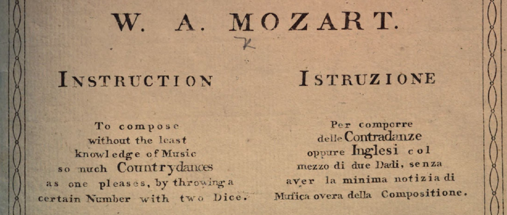

---
tags:
  - Artikler
---

??? abstract "Kapitelabstrakt"

    Denne bog introducerer til programmering som et kreativt redskab for musikstuderende på de videregående uddannelser. Med afsæt i platformen SuperCollider introducerer bogen på grundlæggende niveau til unikke tilgange til komposition og lydproduktion fra computermusikkens verden. Bogen er henvendt til studerende eller særligt interesserede som ikke nødvendigvis har erfaring med programmering, men som har kendskab til musikteori og -teknologi på grundlæggende niveau.

    Dette indledende kapitel introducerer programmering som en musikalsk aktivitet i et historisk perspektiv og forklarer hvordan redskabet SuperCollider passer ind i det musikteknologiske landskab. I bogen arbejdes der på to niveauer - det overordnede kompositionsniveau, hvor vi bruger algoritmer til at generere musikalske forløb, og det mere detaljerede niveau, hvor vi arbejder med at producere lyd med lydsignalernes byggeklodser i form af oscillatorer, samples, envelopes, filtre mm. Det særlige ved SuperCollider er, at man kan kombinere disse to abstraktionsniveauer, hvilket gør redskabet utroligt fleksibelt og righoldigt.

# En ultrakort historie om programmeringsredskaber og computermusik

Matematikeren og grevinden Ada Lovelace er af computerhistorikere posthumt blevet anerkendt som verdens første programmør, fordi hun i 1842 beskrev det, der sidenhen er blevet betegnet som den første computeralgoritme [@gregersen2015]. Lovelace var meget optaget af den samtidige forsker Charles Babbages arbejde med hulkort-maskiner, som var forgængere til nutidens digitale computere. Babbage arbejde blandt andet med at designe en "Analytical engine", der groft sagt skulle fungere som det vi i dag ville kalde en regnemaskine. Men Lovelace så et meget større potentiale i Babbages hulkortmaskine end den oprindelig var tiltænkt, nemlig at den med abstrakte operationer ville kunne gøre meget andet end foretage udregninger med tal - eksempelvis at komponere musik:

> It might act upon other things besides *number*, were objects found whose mutual fundamental relations could be expressed by those of the abstract science of operations, and which should be also susceptible of adaptations to the action of the operating notation and mechanism of the engine. Supposing, for instance, that the fundamental relations of pitched sounds in the science of harmony and of musical composition were susceptible of such expression and adaptations, the engine might compose elaborate and scientific pieces of music of any degree of complexity or extent. [@lovelace2015, p. 162]

Selvom der skulle gå mere end et århundrede før den computergenererede musik blev udbredt, har Lovelace så afgjort fået ret i sin forudsigelse. I bred forstand kan man sige, at alle de digitale redskaber hvormed vi i dag producerer, distribuerer og forbruger musik, er baseret på computerprogrammering - om end vi interagerer med de fleste af disse redskaber gennem grafiske brugerflader eller fysiske interfaces. I mere konkret forstand er programmering for nogle musikere og komponister inden for computermusikken og den elektroniske musik i dag det primære redskab til at skabe musik, da de nuværende redskaber giver en fantastisk frihed og fleksibilitet, hvis man er villig til at sætte sig ind i programmeringsteknikkerne.

Computermusikkens redskaber har gennemgået en omfattende udvikling siden de tidligste eksperimenter med computerbaseret komposition i midten af det 20. århundrede. Fokuserer vi specifikt på musik- og lydprogrammering, er der også sket ganske meget siden de første forskere i 1950'erne eksperimenterede med at få dyre mainframe-computere til at komponere musik. I disse tidlige eksperimenter skabte computeren et partitur uden nogen form for klangdannelse. I 1957 opfandt Max Mathews ved AT&T Bell Laboratories programmeringssproget *MUSIC*, der sammen med efterfølgerne *MUSIC II*, *MUSIC III*, *MUSIC V* m.fl. kendes under betegnelsen "*MUSIC-N* languages" [@wang2017, p. 61].

Med *MUSIC-N* og opfindelsen af [DAC-enheder](https://en.wikipedia.org/wiki/Digital-to-analog_converter), som konverterer et digitalt signal til et analogt, blev vejen banet for, at computere både kunne generere partiturer og tilmed realisere de lyde, som partituret specificerede. Fra *MUSIC III* var et centralt designprincip på plads, som også efterfølgende musikprogrammeringssprog baserede sig på, nemlig kategoriseringen af tonegeneratorer, filtre, envelopegeneratorer mm. som såkaldte *Unit Generators* (i daglige tale *UGens*) [@wang2017, p. 61]. Man sammensætter disse UGens til en slags, så eksempelvis en envelopegenerator-UGen styrer amplituden/lydstyrken for en sinustone, der er genereret med en tonegenerator-UGen. I *MUSIC-N*-lingo kalder sådan en sammenkobling for et "instrument" og en samling af sådanne instrumenter for et "orkester". Dette orkester kan så realisere et "partitur", analogt til almindelig praksis med musikalsk fremførelse baseret på musiknotation [@wang2017, p. 61]. Dette skete dog ikke i realtid, da computeren møjsommeligt skulle tygge sig igennem et partitur og derved skabe en lydfil. Ifølge Mathews kunne den computer, han arbejdede med i slutningen af 1950'erne, bruge flere minutter på at generere blot ét sekunds lyd, og det endda med ganske begrænsede klanglige muligheder [@collins2017a, p. 84].

I forlængelse af *MUSIC-N* blev der skabt mere moderne og avancerede programmeringssprog og -platforme til musik og lyd, herunder først og fremmest [*Csound*](https://csound.com/) fra midten af 1980'erne, der som open source-projekt fortsat er i anvendelse i dag. Csound kunne ikke oprindeligt generere lyd i realtid (hvilket dog er blevet tilføjet sidenhen) - der skulle i stedet et andet projekt til for at ændre dette: I 1980'erne skabte Miller S. Puckette ved [IRCAM](https://www.ircam.fr/) det i dag meget udbredte værktøj [*Max*](https://cycling74.com/products/max), der var opkaldt efter førnævnte Max Mathews. *Max* var i første omgang designet til at være et MIDI-system, der kunne styre ekstern signalbehandlingshardware i IRCAM's eksperimentelle lydstudier og blev udgivet som kommerciel software. Det innovative ved *Max* var, at der er tale om en grafisk brugerflade, hvor brugeren opretter forskellige små bokse og forbinder dem med virtuelle kabler for at definere signalflowet, lidt ligesom en modulær synthesizer.

Senere udviklede Puckette et nyt system kaldet [*Pure Data*](https://puredata.info/) (i daglig tale blot *Pd*), der i sin brugerflade var en gentænkning af *Max*, men derudover også inkorporerede en lyd-engine, som man kunne styre fra brugerfladen [@puckette1996]. *Pd* er open source, og lyddelen blev derfor også inkorporeret i *Max*, der i den sammenhæng fik navnet *Max/MSP*. *Pd*, som er gratis og open source, og den kommercielle slægtning *Max/MSP* er i dag meget populære og udbredte redskaber inden for computermusik. Begge platforme er gode kandidater til at blive anvendt af musikstuderende i dag, fordi de med den grafiske brugerflade er lette at komme i gang med, hvis man ikke har arbejdet med programmering før. Når de ikke er valgt som platform til denne bog, er det fordi de mere omfattende projekter, man går i gang med umiddelbart efter begynderstadiet, hurtigt bliver yderst komplekse og vanskelige at håndtere i den visuelle platform. Dertil er en tekstbaseret tilgang bedre egnet, om end dette selvfølgelig også afhænger af personlige præferencer og færdigheder.

[*SuperCollider*](https://supercollider.github.io/), der er platformen i denne bog, blev oprindeligt skabt af James McCartney og udgivet som kommerciel software i 1996 [@mccartney2002]. I 2002 frigav McCartney imidlertid SuperCollider under en open source-licens, og projektet udvikles og anvendes i dag af musikere, komponister, forskere, lyddesignere m.fl. i et omfattende open source-fællesskab. SuperCollider er i den aktuelle version 3 et af de mest fremtrædende redskaber til algoritmisk komposition og programmatisk lydproduktion vi har til rådighed i dag.

Et af de særlige træk ved SuperCollider er, at det består af tre dele: Et tekstbaseret programmeringssprog, en state-of-the-art lydserver samt en dedikeret teksteditor med indbygget dokumentation og hjælp. På grund af denne tredelte opbygning kan SuperColliders lydserver anvendes som komponent i andre systemer, hvilket er blevet udnyttet i mange specialdesignede programmeringsplatforme som [*Sonic Pi*](https://sonic-pi.net/), [*TidalCycles*](https://tidalcycles.org/), [*Overtone*](https://overtone.github.io/) m.fl. Et andet nyere skud på stammen, der dog ikke har lige så stor anvendelse som Pd, Max/MSP og SuperCollider, er programmeringssproget [*ChucK*](https://chuck.cs.princeton.edu/), som er ganske interessant men knap så oplagt som et redskab til begyndere.

Med denne bog ønsker jeg at bidrage til, at flere musikere får adgang til de fantastiske muligheder, musik- og lydprogrammering giver inden for komposition og lydproduktion. I dag kan enhver med en laptop, en DAW og et abbonnement på loops og samples relativt let skabe musik, sammenlignet med de lydstudieressourcer, der var nødvendige for blot få årtier siden. Samtidig med at denne almengørelse af musikteknologien giver flere mennesker får mulighed for fremstille musik, bliver det samtidig sværere som kunstner at skille sig ud fra mængden. At investere tid og engagement i programmering som redskab er for musikere og komponister giver mulighed for at skabe unikke musikalske og lydlige træk, som kun vanskeligt eller slet ikke kan frembringes med mere gængs, kommerciel musiksoftware.

# Bogens fokusområder

Programmering kan i dag foregå på mange forskellige abstraktionsniveauer, da der findes ganske mange programmeringssprog, som er designet med forskellige formål. Den såkaldte [maskinkode](https://www.britannica.com/technology/machine-language) udgøver det laveste niveau og består af sekvenser af binære tal, som indikerer basale operationer, der kan udføres af en computerprocessor. For mennesker er maskinsprog yderst vanskelig at fremstille og læse, fordi det er så fjernt fra menneskers ordinære sprog. Derfor har man opfundet en række programmeringssprog, der opererer på et højere abstraktionsniveau. I det børnevenlige programmeringssprog [Scratch](https://scratch.mit.edu/) kan man eksempelvis lave små spil ved at sammenkoble forskellige klodser med musen.

SuperCollider og andre musikfokuserede programmeringssprog fungerer på et relativt højt abstraktionsniveau. Det betyder i denne sammenhæng, at mange tekniske detaljer er abstraheret væk, således at programmøren kan fokusere på de musikalske/lydlige aspekter. Det vi typisk arbejder med her, svarer i nogen udstrækning til de ovenfor nævnte metaforer "partitur" og "orkester". I det følgende vil jeg kort uddybe, hvad det betyder i denne bog. Mere specifikt skal vi i bogen arbejde med det, man kalder algoritmisk komposition (svarende til "partituret"), dvs. vi skal fremstille algoritmer og mønstre, der kan generere musikalske forløb. Derudover skal vi også arbejde med klangdannelse, dvs. vi skal fremstille små programmer, der designer de enkelte klange og lyde, vores kompositioner består af.

## Algoritmisk komposition

Umiddelbart kunne man godt forestille sig, at algoritmisk komposition er noget, der primært hører til computermusikken. Men en algoritme kan defineres som en foreskrevet proces, som gennem en række konkrete trin har til formål at løse et bestemt problem. Og i den betydning har algoritmen en længere historie som et musikalsk-kompositorisk redskab.

> Within the field of algorithmic composition the algorithm constitutes an abstract model which defines and controls some or all structural aspects of the music. This model can also serve as a generator that is capable of producing the piece as a possible variant within a field of possibilities. The latter approach can be implemented as a computer program, but the underlying idea is much older. [@essl2017, p. 105]

Essl sporer algoritmisk kompositionsteknik helt tilbage til den tidlige polyfone musik, som er noget af det ældste nedskrevne musik, der findes i vesten [@essl2017, p.106]. Nyere eksempler findes i J. S. Bachs regelbaserede kompositionsteknikker og såkaldte gådekanon-kompositioner samt i W. A. Mozarts berømte *Musikalisches Würfelspiel*, hvor terningekast afgør rækkefølgen af det musikalske materiale og dermed giver mulighed for at skabe forskellige variationer over den underliggende metrik og harmonik [@essl2017, p.106; @mozart1793].

{ width="80%" }

I det 20. århundredes vestlige kompositionsmusik indgår algoritmisk komposition i flere af hovedstrømningerne. Med først tolvtonemusikken og senere hen serialismen og aleatorikken gør mange komponister forskellige algoritmer til det centrale redskab i deres kompositionsproces. I modsætning til de ofte meget deterministiske algoritmer komponisten Iannis Xenakis introducerede idéen om *stokatisk* musik, hvor tilfældighedsoperationer baseret på forskellige matematisk bestemte sandsynligheder bliver en central del af algoritmerne. I forlængelse af minimalismen, den amerikanske eksperimentalmusik og den tidlige ambiente musik blev idéen om *generativ komposition* stadfæstet som et af den moderne kompositionsmusiks modus operandi. De tidligere omtalte udviklinger inden for computerteknologi og redskaber til computermusik blev gradvist en del af kompositionsmusikken, og computermusikken vandt frem som et selvstændigt felt, hvori algoritmisk komposition spiller en væsentlig rolle.

SuperCollider er et fantastisk redskab til algoritmisk komposition, blandt andet fordi programmeringssproget indeholder et omfattende bibliotek af såkaldte patterns - generative mønstre, der kan kombineres på mange forskellige måder. I denne bog udforsker vi på grundlæggende niveau hvordan disse redskaber kan vi styre både overordnede formmæssige forhold i musikken, men også hvordan vi kan skabe variationer og musikalsk indhold på mere detaljerede niveauer. Én praktisk tilgang er at bruge SuperCollider som en generativ maskine, der spiller på andre synthesizere eller styrer instrumentplugins i en DAW, fx via MIDI. Men der er mange fordele ved at bruge SuperColliders egen lydserver i stedet, hvor vi selv kan designe klangdannelsen. Man kan på denne måde bruge algoritmisk komposition til ikke blot at styre traditionelle kompositionsparametre som tonehøjde, rytmik og dynamik, men også til at variere og komponere med andre lydlige parametre.

## Klangdannelse og lyddesign

Klangdannelse sker naturligt, når fysiske objekter bliver sat i vibration og derfor udsender lydbølger. Objektets akustiske egenskaber medvirker til afgøre klangen, hvilket ligger til grund for akustiske instrumenter. Den elektroniske klangdannelse har, ligesom algoritmisk komposition og computermusik, en interessant historie, der kun kort kan antydes her. Den tidlige elekroniske klangdannelse var udelukkende analog, hvor elektriske komponenter sammensat i kredsløb genererede strømsignaler, der blev omdannet til lyd via højttalere. Selv i dag er den analoge klangdannelse lidt af et plusord, da den ofte forbindes med en særligt "varm" kvalitet, og der produceres derfor også i dag analoge synthesizere. Men digital teknologi har en række fordele, heriblandt fx at instrumentets tonehøjde ikke varierer, når temperaturen stiger og falder (hvilket er tilfældet med mange analoge synthesizere, hvor den elektriske modstand i udstyret varierer med temperaturen). En tilstrækkeligt kraftig digital computer kan uden problemer fremstille lyden af tusindvis af oscillatorer (tonegeneratorer) i realtid, hvor en analog synthesizer, der skulle gøre det samme, ville kræve tusindvis af elektriske komponenter, hvilket er urealistisk i et hardwaresetup.

Størstedelen af redskaberne til elektroniske klangdannelse er derfor i dag digitale, hvad enten de findes i plugin-form eller som hardwareenheder. Men selv digitale lydredskaber søger ofte at emulere lyden af analogt grej ved at tilføje forskellige former for støj og lydlige artefakter som klanglig farvning af et lydsignal. "Virtual analog" er blevet en væsentlig salgsrubrik. Samtidig lever den såkaldt modulære synthesizer i bedste velgående, hvor der efterhånden findes tonsvis af lyd- og kontrolmoduler i det populære "Eurorack"-format. Også den modulære synthesizer er blevet emuleret digitalt, blandt andet af programmet [*VCV Rack*](https://vcvrack.com/) (og open source-klonen [*Cardinal*](https://cardinal.kx.studio/)). Med disse modulære redskaber består kompositions- og lyddesignarbejdet i at koble forskellige moduler sammen med patchkabler og justere på modulernes indstillinger ved hjælp af fadere og drejeknapper.

I SuperCollider og lignende platforme kan vi på samme måde arbejde med enheder, der svarer til elektriske komponenter som tonegeneratorer og hardware-moduler som envelopegeneratorer eller granular synthesis-moduler. Dette gør vi ved hjælp af SuperColliders lydserver og de ovenfor omtalte *UGens*. De fleste UGens har forskellige *input* og *output* samt en række *indstillinger*. Som eksempel kan vi tage sinustonegeneratoren `SinOsc`, der er en af de UGens, vi møder senere i bogen. Den har som output et lydsignal i form af en sinusbølge. Den har også et frekvens-input, hvormed vi kan styre hvor mange gange per sekund vi gennemløber bølgeformen (og dermed styre hvilken tonehøjde, der spilles). Dette input kan vi indstille til en fast værdi, fx 440Hz, kammertonen, eller vi kan styre det med en anden UGen, så tonehøjden varierer over tid. I det tilfælde siger vi, at vi *modulerer* oscillatorens frekvens. SinOsc har også nogle indstillinger, eksempelvis kan vi specificere initialfasen, dvs. hvor i bølgeformen, oscillatoren skal begynde, når den først bliver sat i gang.

Der findes ganske mange UGens, hvormed vi kan skabe og transformere klange, arbejde med samples og så videre. Klassiske klangdannelsesteknikker kan fint implementeres i SuperCollider, hvilket denne bog viser på flere forskellige områder. Men der er ingen faste regler, når det gælder kreative praksisser som komposition og lyddesign, og vi kan derfor også udvide, "hacke" og eksperimentere inden for klangdannelsen. Ved at gøre det opnå man to vigtige ting:

- For det første kan vi skabe unikke klanguniverser, der ikke lyder som alle de almindelige plugins. Dette betyder ikke, at SuperCollider eller andre lignende platforme skal erstatte de sædvanlige redskaber som DAWs og plugins. Men det er et unikt redskab at have adgang til, når man vil skille sig ud både i lydligt resultat og i kompositionsmetode.
- For det andet, og mindst lige så vigtigt, kan vi ved at eksperimentere med klangdannelse i SuperCollider lære en masse om lyd, klang og digital lydteknologi. Det sidste er vigtig viden i en tid, hvor digital musikproduktion er blevet allemandseje og er markedsgjort i en meget udstrakt grad. Det er med andre ord meget væsentligt at kunne gennemskue på et grundlæggende niveau, hvordan teknologierne fungerer og hvad de kan anvendes til.

I de følgende kapitler arbejder vi med disse to abstraktionsniveauer først hver for sig, og derefter i kombination. Men først en advarsel: Når man har fået blod på tanden og fornemmer mulighederne ved kombination af disse to stærke redskaber, kan det være svært at lægge fra sig igen. God fornøjelse med komposition og lydproduktion i SuperCollider!
