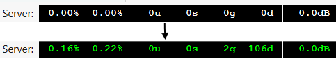

---
tags:
    - Artikler
---

# Eksekvering af kode

Man eksekverer kode ved at taste Ctrl+Enter på Windows/Linux eller Cmd+Enter på Mac. Prøv det selv:

- Indtast linjerne herunder i et SuperCollider-dokument.
- Sæt cursoren på en af linjerne og tast Ctrl+Enter (PC) eller Cmd+Enter (Mac).
- Iagttag derefter outputtet i SuperCollider's "Post window" (som ved et nyinstalleret setup vil befinde sig til højre i skærmbilledet).

```sc title="Eksekvering af kildekode, linje for linje"
5 + 10;
Scale.major;
rrand(0, 100);
"Vekseldominant".postln;
```

## Mere end én handling ad gangen med kodeblokke

Hvis vi gerne vil gøre mere end én ting ad gangen, kan vi adskille vores instrukser (statements) til SuperCollider ved hjælp af semikolon:

``` sc title="Flere statements på én kodelinje med semikolon"
"Et fantastisk tal:".postln; rrand(0, 100).postln;
```

Hvis vi udelader semikolon, kan SuperCollider ikke forstå hvor den ene instruks stopper og hvornår den næste starter. Det er derfor - med nogle få vigtige undtagelser - typisk fornuftigt at afslutte sine kodelinjer med et semikolon.

Ofte er det en god idé at fordele instrukserne over flere linjer. Hvis vi vil have SuperCollider til at udføre flere linjer med instrukser umiddelbart efter hinanden, kan vi gøre dette ved at afslutte de enkelte linjer med semikolon og omkranse linjerne med parenteser. Dette kaldes en *kodeblok*. Kodeblokken eksekveres ved, at man sætter cursoren på en af linjerne og trykker Ctrl/Cmd-Enter. Det betyder ikke noget præcis hvilken linje, bare cursoren befinder sig et sted mellem de yderste parenteser.

``` sc title="En kodeblok"
(
"Endnu et fantastisk tal:".postln;
rrand(50, 100).postln;
)
```

Læg mærke til hvordan begge linjer i kodeblokken ovenfor bliver udført så hurtigt efter hinanden, at det stort set sker samtidigt.

## Sæt gang i lydserveren

For at kunne bruge programmering som et redskab til musikalsk komposition og lyddesign skriver vi ofte kildekode, som genererer lyd. I de tilfælde skal vi først starte SuperColliders lydserver. Den mest enkle måde at starte lydserveren på er at køre denne linje:

``` sc title="Start og stop af SuperColliders lydserver"
s.boot;
```

Alternativt kan man taste Ctrl/Cmd-B, gå via menuen "Server" øverst i vinduet, eller højreklikke på tallene i nederste højre hjørne ud for "Server". Bemærk, at når lydserveren er bootet, bliver disse tal grønne. Når serveren bootes ser vi desuden en del tekstbeskeder til højre i SuperColliders "Post window", herunder hvilket lydkort, lydserveren er forbundet med.

{ width="70%" }

Derefter kan vi afspille lyde på serveren (tast Ctrl/Cmd+Punktum for at slukke lyden):

``` sc title="Et par simple lyde"
{ SinOsc.ar(440) * 0.1 }.play;
Pbind(\degree, [0, 2, 4]).play;
```

*Hvis din server ikke booter:* Skulle din server mod forventning ikke starte, kan det ofte skyldes indstillingerne i lydkortet eller driverproblemer. På Mac sker det jævnligt, at styresystemet indstiller input og output til to forskellige samplerates. Dette er imidlertid ikke kompatibelt med SuperColliders lydserver, hvilket man kan se, hvis man i post window får fejlmeddelsen "Sample rate mismatch". I den situation er man nødt til at indstille styresystemet korrekt, og det er heldigvis enkelt: Kør nedenstående for at åbne "Audio MIDI Setup" og indstil input og output til den samme samplerate (fx 44.1kHz eller 48kHz).

```sc title="Løsning til 'sample rate mismatch'-fejl på Mac"
// Linjen herunder åbner programmet 'Audio MIDI Setup'
"open -a 'Audio MIDI Setup'".unixCmd;
```
