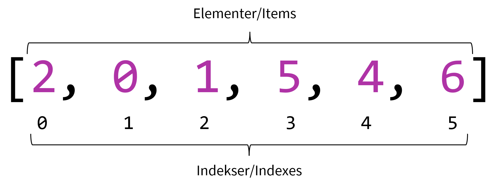

---
tags:
    - Artikler
---
# Organisering med lister

Når vi arbejder med musik, har vi ofte brug for at organisere musikalske parametre som rækker af tal. Fx kan man sige, at tonerne i en komposition udgør en lang liste af nodeværdier og tonehøjder. Man kan anskue skalaer og akkorder som lister af intervaller eller skalatrin. Eller man kan se rytmiske sekvenser som en liste af tidsintervaller - osv. Rytmer, akkorder, sekvenser, tonetrin, skalaer, varigheder, overtoner osv. kan altså repræsenteres som rækker af tal. Til at organisere disse rækker af tal bruger vi noget, der kaldes "arrays", som vi på dansk blot kan kalde *lister*. I denne bog bruges begge termer om det samme[^1]. Det er heldigvis ganske enkelt at bruge lister, og det er yderst nyttigt at vide hvordan de fungerer.

[^1]: Lister/arrays hører teknisk set til klassen `Array` i SuperCollider, men der findes også en beslægtet datastruktur, der hedder `List`. Forskellen mellem de to er blot, at sidstnævnte kan udvides dynamisk. Nysgerrige læsere henvises til SuperColliders dokumentation.

En liste/et array er teknisk set en såkaldt [datastruktur](https://www.britannica.com/technology/data-structure), som kendetegnes ved, at den indeholder en samling af **elementer**, der er sat i en bestemt **rækkefølge**. Hvert element har en plads i rækkefølgen, som betegnes elementets **indeks**. Det første element har indeks 0, det næste indeks 1, og så fremdeles.

{ width="50%" }

## Notation og brug af lister

Hvis vi ønsker at notere de tre skalatrin i en akkord uden lister, kan vi gøre ved hjælp af [variabler](a-variabler.md). Det kunne eksempelvis være på denne måde: `~tone1 = 0; ~tone2 = 2; ~tone3 = 4;` - men det er typisk ikke særligt effektivt i længden. Når man ser et mønster som dette, er det typisk på tide at overveje at bruge en liste. For at notere vores akkord som en liste bruger vi kantede parenteser til afgrænse listen, og så noterer vi elementerne, adskilt med komma. Hvis vi gemmer vores liste som en variabel, kan vi tilgå elementerne enkeltvis ved at angive deres indeks, omkranset af kantede parenteser, efter variabelnavnet.

```sc title="Listenotation"
~akkord = [0, 2, 4];

~akkord[0].postln; // -> 0
~akkord[1].postln; // -> 2
~akkord[2].postln; // -> 4
```

Vi kommer [senere](../02/a-patterns-intro.md) til at se nærmere på, hvordan man bruger en liste som vores akkord ovenfor til faktisk at spille en akkord. Her er dog en smagsprøve (husk at boote lydserveren, før du eksekverer kildekoden):

```sc title="Første lydeksempel med lister"
~akkord = [0, 2, 4];

// Akkorder
Pbind(\degree, ~akkord);
Pbind(\degree, ~akkord, \strum, 0.05);

// Akkordbrydninger
Pbind(\degree, Pseq(~akkord));
Pbind(\degree, Pshuf(~akkord, 2));
```

## Matematik med lister

En af de mange fordele ved at samle vores data i én struktur er, at vi kan arbejde med alle elementerne på én gang. Vi kan eksempelvis foretage matematiske operationer, som bliver udført for alle elementerne. Det skyldes, at når en liste udelukkende indeholder tal (i modsætning til fx tekstbidder eller andre objekter), så understøtter listen som regel også de methods, som knytter sig til tal.

```sc title="Matematiske operationer med lister"
[0, 2, 4] + 1;
// -> [1, 3, 5]

[0, 2, 4] * 2;
// -> [0, 4, 8]

[0, 2, 4].pow(2); // .pow(2) betyder "i anden"
// -> [0, 4, 16]
```

Der findes derudover en lang række [methods](a-methods.md), som er særlige for lister. Vi kan fx bede om en sum, et gennemsnit, et plot og mange andre funktioner.

```sc title="Methods til lister"
[0, 2, 4].sum;
// -> 6

[0, 2, 4].mean;
// -> 2

[0, 2, 4].plot;
// -> En graf over data
```

## Iteration over lister

Hvis man ønsker at gøre noget for alle elementer i en liste, men ikke kan finde en indbygget method til at opnå det ønskede resultat, kan man angive - you guessed it - en [funktion](a-funktioner.md), som kører for hvert element. Inden for programmeringsverdenen siger man i det tilfælde, at man *itererer over listens elementer*. Hertil findes der særligt to nyttige methods for lister: `.do` og `.collect`. Forskellen på de to er, at førstnævnte blot udfører funktionen for hvert element, hvor sidstnævnte skaber et nyt array med outputtet fra hvert funktionskald. Det lyder måske teknisk, men lad os tage nogle eksempler for at forstå sammenhængen.

For at iterere over en liste angiver vi som et argument til `.do` den funktion, vi ønsker at udføre. Inde i den funktion [opretter vi et argument](a-funktioner.md#argumenter). Herunder vises de tre elementer blot i post window med et lille stykke tekst efter.

```sc title="Iteration med .do"
(
~akkord = [0, 2, 4];

~akkord.do({
    arg trin;
    (trin + " er et flot tal.").postln;
});
)
```

Ønsker vi at bruge elementernes respektive indeks i funktionen, kan vi også gøre det - her indfører vi endnu et argument, som ved hvert funktionskald vil modtage det aktuelle elements indeks.

```sc title="Iteration med indeks"
(
~akkord = [0, 2, 4];

~akkord.do({
    arg trin, indeks;
    ("I denne iteration kigger vi på indeks " + indeks).postln;
    (trin + " er et flot tal.").postln;
});
)
```

Sidst men ikke mindst kan vi bruge `.collect` til at transformere arrays. Her kan jeg eksempelvis fremstille en akkordrækkefølge, altså en liste bestående af lister:

```sc title="Iteration med .collect"
(
~akkord = [0, 2, 4];

// Æblemand-sekvens - trin: I-VI-II-V
~grundtoner = [0, -2, 1, -3];

~akkorder = ~grundtoner.collect({
    arg trin;
    ~akkord + trin;
});

~akkorder.postln;
// -> [ [ 0, 2, 4 ], [ -2, 0, 2 ], [ 1, 3, 5 ], [ -3, -1, 1 ] ]

// Afspil akkorden:
Pbind(\degree, Pseq(~akkorder)).play;
)
```

Iteration er et særdeles nyttigt redskab, som både benyttes i komposition, som antydet ovenfor, og i klangdannelse. Vi bruger eksempelvis iteration til definere oscillatorbanke, når vi skal arbejde med overtonerækker. Men mere herom [senere](../07/a-oscillatorbanke.md).

## Tricks til skabelse af lister

I stedet for at definere vores lister manuelt kan vi være snedige og oprette dem med en algoritme. Det kan fx være, at vi gerne vil have en lineær talrække . Eller en liste med 100 tilfældige tal mellem 0 og 127 (som er den dynamiske rækkevidde i MIDI-protokollen). Eller en liste med elementer skabt af en funktion. I disse situationer kan du have glæde af disse tips og tricks.

### Automatiske talrækker

Lineære talrækker, dvs. en liste med tal, hvor der er et bestemt interval mellem på hinande følgende tal, kan genereres ganske let. Class-method'en `Array.series(antal, start, interval)` laver et array med det angivne antal elementer, det første element vil have startværdien, og de efterfølgende værdier vil have den forudgående værdi + det angivne interval. Denne form er meget tydelig og læsbar, men har dog den ulempe/fordel, at man ikke kan se, hvor talrækken slutter (altså hvad der vil være det sidste tal i listen). I stedet kan man bruge den syntaktiske genvej `(start..slut)`.

```sc title="Automatiske talrækker"
// Alle heltal fra 10 til 20
Array.series(11, 10, 1);
(10..20);
// -> [ 10, 11, 12, 13, 14, 15, 16, 17, 18, 19, 20 ]

// De lige tal fra 10 til 20
Array.series(6, 10, 2);
(10, 12..20);
// -> [ 10, 12, 14, 16, 18, 20 ]

// 5-tabellen
Array.series(11, 0, 5);
(0, 5..50);
// -> [ 0, 5, 10, 15, 20, 25, 30, 35, 40, 45, 50 ]
```

Disse tilgange virker i øvrigt også med decimaltal og negative intervaller:

```sc title="Talrækker med decimaltal og negative intervaller"
// Virker også med decimaltal...
Array.series(11, 0, 0.1);
(0, 0.1..1);
// -> [ 0.0, 0.1, 0.2, 0.3, 0.4, 0.5, 0.6, 0.7, 0.8, 0.9, 1.0 ]

// ... og negative intervaller
Array.series(11, 0, -1);
(0..-10);
// -> [ 0, -1, -2, -3, -4, -5, -6, -7, -8, -9, -10 ]
```

Hvilken form er at foretrække? Det kommer an på, om man på forhånd gerne vil vide hvor mange elementer, der er i listen (hvis det fx skal passe med længden af en musikalsk sekvens) - så er Array.series bedst. Hvis det er vigtigere at kende start- og slutgrænsen, kan vi bruge genvejen.Der findes dog en beslægtet tilgang, som i nogle tilfælde er handy: `Array.interpolation(antal, start, slut)` genererer en liste med det ønskede antal elementer, fordelt lineært mellem start og slut:

```sc title="Array.interpolation"
Array.interpolation(9, 2, 10);
// -> [ 2.0, 3.0, 4.0, 5.0, 6.0, 7.0, 8.0, 9.0, 10.0 ]
```

### Lister med tilfældigt genererede tal

Ønsker vi en liste med tilfældigt genererede tal, kan vi bruge `Array.rand(antal, minimum, maksimum)`. Lad os eksempelvis generere en liste med 10 tal mellem 0 og 127 (som er rækkevidden i MIDI-protokollen):

```sc title="Lister med tilfældige tal"
// Kør denne instruks flere gange for at se resultatet
Array.rand(10, 0, 127);
// -> [ 38, 63, 11, 82, 63, 107, 47, 13, 92, 79 ]
// -> [ 67, 99, 121, 78, 93, 67, 87, 85, 102, 32 ]
// -> [ 31, 11, 40, 122, 86, 11, 20, 87, 15, 127 ] osv.
```

Dette kan vi eksempelvis bruge til at spille forskellige toner eller volumen-indstillinger på en ekstern synthesizer via MIDI.

Der findes et par beslægtede methods, som kan være nyttige, blandt andet `Array.rand2()` og `Array.exprand`. Særligt interesserede læsere kan se hvordan de fungerer i SuperColliders dokumentation - se sektionen om class methods under [opslaget om `Array`](https://doc.sccode.org/Classes/Array.html).

### Hjemmestrikkede algoritmer til at generere lister

Kan vi ikke finde et indbygget redskab til at skabe vores liste, kan vi altid skrive en funktion, der producerer listen for os. Det kan vi gøre ved hjælp af `Array.fill(funktion)`, der på mange måder minder om de iterationsteknikker, vi arbejdede med ovenfor.

Lad os sige, at jeg vil skabe en liste med 10 frekvenser, der svarer til tilfældigt valgte MIDI-tonehøjder inden for to oktaver. Vi kan også vise MIDI-tonehøjderne i post window, mens vi skaber listen.

```sc title="Hjemmestrikket liste med Array.fill"
(
Array.fill(8, {
    var tone = rrand(48, 72);
    tone.postln;
    tone.midicps;
});
// -> [ 391.99543598175, 164.81377845643, 184.99721135582, 195.99771799087, 184.99721135582, 311.12698372208, 207.65234878997, 220.0 ]
)
```

Sidst men ikke mindst kan det være nyttigt at bruge elementernes indeks i funktionen. Dertil kan vi oprette et argument, ligesom ovenfor i forbindelse med iteration. Lad os eksempelvis ved hjælp af indekstallene beregne frekvenserne for de første 10 naturlige overtoner for en tone, der klinger ved 220Hz:

```sc title="Den naturlige overtonerække"
(
~overtoner = Array.fill(10, {
    arg indeks;
    // vi lægger 1 til, fordi vi starter ved indeks 0
    var toneNummer = indeks + 1;
    220 * toneNummer;
});
// -> [ 220, 440, 660, 880, 1100, 1320, 1540, 1760, 1980, 2200 ]
)

// Boot lydserveren for at høre tonerne
{ SinOsc.ar(~overtoner).sum * 0.01; }.play;
```

I SuperCollider og mange andre programmeringssprog er der ofte mere end én metode til at opnå det samme resultat. Vi kan fx bruge `.collect`, som blev introduceret ovenfor i forbindelse med iteration, sammen med genvejen til at beskrive lineære talrækker, til at opnå samme resultat som ovenfor. Eller vi kan bruge simple matematiske operationer, også som beskrevet ovenfor.

```sc title="Alternativer til Array.fill"
(1..10).collect({
    arg toneNummer;
    220 * toneNummer;
});
// -> [ 220, 440, 660, 880, 1100, 1320, 1540, 1760, 1980, 2200 ]

(1..10) * 220;
// -> [ 220, 440, 660, 880, 1100, 1320, 1540, 1760, 1980, 2200 ]
```

Der er ikke nogen tilgang, som er mere rigtig end andre. Vi bruger primært `Array.fill`, når der ikke findes tilsvarende methods eller genveje - eller hvis vi foretrækker den eksplicitte og tydelige form, når vi skal skrive og læse koden. Ellers kan vi også bruge ovenstående alternativer.
