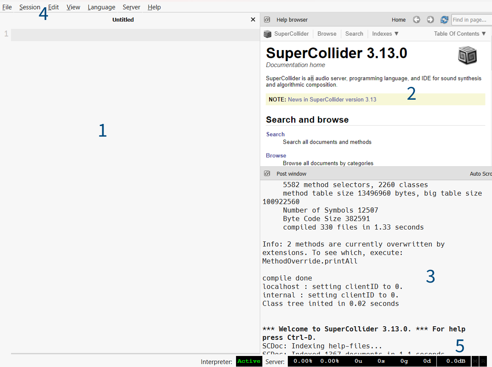

---
tags:
    - Artikler
---

??? abstract "Introduktion til kapitlet"

    Første gang man åbner SuperCollider, mødes man af en umiddelbart noget minimalistisk brugerflade. Med mindre man har arbejdet med programmering før, vil det i begyndelsen være lidt uvant, at brugerfladen først og fremmest består i et tekstdokument, hvor man noterer og eksekverer kildekode. Men det ændrer sig hurtigt, når man kommer i gang, og inden længe kommer man til at sætte pris på den enkelhed, brugerfladen også repræsenterer.
    
    Dette kapitel introducerer til grundlæggende programmering i SuperCollider. Som det første lærer vi den grundlæggende syntaks, så vi kan skrive og eksekvere kildekode. Derudover introduceres nogle grundlæggende begreber og teknikker, som det er vigtigt at have styr på, inden vi går videre. Det drejer sig om brug af såkaldte [*variabler*](a2-variabler.md) og [*methods*](a3-methods.md), samt *argumenter*. Det er nemlig nødvendigt at have et grundlæggende ordforråd, så man kan læse og forstå SuperCollider-kildekode.

    I slutningen af kapitlet indgår nogle [grundlæggende programmeringsøvelser](e1-basics.md) og [øvelser med lyde](e2-lyd.md), men vores hovedprioritet er altså her i første kapitel at forstå, skrive og eksekvere kildekode i SuperColliders brugerflade. Men bare rolig, vi skal nok skabe nonget lyd: I [næste kapitel](../02/a1-patterns-intro.md), der handler om generativ komposition med patterns, kommer vi til at spille en masse toner.

# SuperColliders brugerflade

Når man åbner SuperCollider, vil der typisk være tre forskellige "kasser", en menu øverst i vinduet samt nogle få dataindikatorer nederst til højre.

1. Den tomme kasse til venstre indeholder dokumenter. Det er her, vi skriver og eksekverer kildekode.
1. Kasse øverst til højre med navnet *Help browser* giver adgang til SuperColliders dokumentation. Det er denne boks, der henvises til, når vi i denne bog taler om at slå noget op i SuperColliders dokumentation.
1. Kassen nederst til højre med navent *Post window* er et vindue, hvor SuperCollider viser nyttige informationer og fejlmeddelelser. 
1. Menuen øverst giver adgang til forskellige almindelige funktioner som "save" og "load" samt nogle SuperCollider-specifikke indstillinger og funktioner.
1. Talrækken nederst til højre giver forskellige informationer om SuperColliders tilstand, primært i forhold til lydserveren. Her kan man højreklikke for at få vist en menu med forskellige funktioner.

{ width="100%" }

Help browser'en og SuperColliders Post window kan flyttes, lukkes eller rykkes til et separat vindue. Men for begyndere kan det være fornuftigt at beholde setup'et som det er indtil videre, så redskaberne er til at finde. Dog kan man nemt genaktivere kasserne via menuen *View*, hvis de er blevet lukket.

## Tre komponenter

Rent teknisk består SuperCollider faktisk af tre forskellige programmer/processer. Det er ikke nødvendigt at kende alle detaljer om, hvordan de fungerer og samarbejder, men det er nyttigt at vide, at de findes.

*scide* - brugerfladen

:   Den grafiske brugerflade, som er beskrevet ovenfor, kaldes også for SuperColliders IDE (Integrated development environment).

*sclang* - fortolkeren

:   Fortolkeren (på engelsk "the interpreter") kører i baggrunden og er ansvarlig for at fortolke og udføre instrukserne i den SuperCollider-kildekode, vi eksekverer i brugerfladen. Starter automatisk, når vi starter brugerfladen. 

*scsynth* - lydserveren

:   Lydserveren kører også i baggrunden og er ansvarlig for at fremstille de lyde, vi (gennem fortolkeren) specificerer. Lydserveren starter ikke automatisk sammen med brugerfladen men skal bootes, før vi kan lave lyd i SuperCollider.
