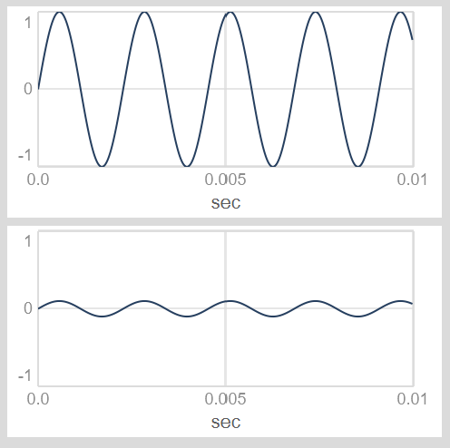

---
tags:
    - Artikler
---

# Modulation af UGens

Ofte ønsker vi, at forskellige parametre ved UGens forandrer sig over tid. Dette kan vi gøre ved hjælp af modulation. Vi kan altid modulere outputtet fra UGens, og i mange tilfælde kan input/argumenter til UGens også moduleres på forskellig vis. Her demonstreres et par centrale teknikker og nyttige methods.

## Modulation af output fra UGens

Vi kan behandle outputtet fra en UGen på forskellige måder, blandt andet med filtre, delay-effekter, distortion med mere.

Her i første omgang fokuserer vi på at modulere amplituden for outputtet fra en UGen. Hvis vi hører UGen'en som et lydligt output, svarer amplitude-modulation til dynamisk justering af lydstyrken.

Når vi ønsker at modulere outputtet fra en UGen på denne måde, kan vi ganske enkelt gange outputtet med modulatoren. Hvis vi fx ganger outputtet fra en `SinOsc` med 0.1, nedskalerer vi amplituden:

```sc title="Modulation af UGen-output"
(
{[
    SinOsc.ar(440),
    SinOsc.ar(440) * 0.1
]}.plot;
)
```

{ width="80%" }

Det er værd at bemærke, at outputtet maksimalt kan være -1 til 1. Værdier derover risikerer at overstyre. Når vi modulerer amplitude for hørbare UGens, skalerer vi derfor oftest amplituden **ned** ved at gange med en faktor mellem 0 og 1:

{==

**Tommelfingerregel**: Outputtet fra en LFO eller envelope, der modulerer et hørbart signals amplitude, bør typisk bevæge sig i intervallet 0-1.

==}

### Skalering fra 0 til maksimum med .unipolar

Skalering af output fra en UGen til et interval fra 0 til et maksimum kan gøres enkelt ved hjælp af method'en `.unipolar`. Sammenlign fx disse bølger, og bemærk hvor outputtet befinder sig på Y-aksen:

```sc title="En trekantet bølgeform udsat for .unipolar"
(
{[
    LFTri.ar,
    LFTri.ar.unipolar
    LFTri.ar.unipolar(0.5)
]}.plot;
)
```

{ width="80%" }

Hvis vi eksempelvis gerne vil modulere amplituden for et signal med pink støj, kan det gøres på følgende vis:

```sc title="Pulserende, pink støj"
{ PinkNoise.ar * LFTri.ar.unipolar(0.5) }.play;
```

Udforsk selv, hvad den tilsvarende method `.bipolar` gør.

## Modulation af input til UGens

Ofte kan det være interessant at modulere inputs til en UGen, dvs. de parametre vi angiver mellem paranteserne efter `.ar`. Her er det selvfølgelig relevant at overveje, hvilke intervaller af input, der giver mening for den UGen, man modulerer.

Ved en UGen, der generer en tone, som vi skal kunne høre, vil det typisk være relevant med frekvens-input, som ligger inden for den menneskelige hørelse, dvs. mellem 20Hz og 20kHz. Noget lignende gælder cutoff-frekvenser til filtre. Her skal det signal, der modulerer inputtet, bevæge sig i et interval, der ligger inden for dette spænd.

{==

**Tommelfingerregel**: Et signal, der modulerer en hørbar oscillator, bør typisk bevæge sig inden for intervallet fra 20 til 20000. Det samme gælder typisk for modulation af cutoff-frekvenser ved filter-UGens.

==}

### Skalering fra minimum til maksimum med .range og .exprange

Her kan vi med fordel bruge to UGen-methods, som hedder `.range` og `.exprange`. I begge tilfælde angiver man et minimum og et maksimum, og oscillatorens output skaleres så henholdsvis lineært og eksponentielt til at bevæge sig mellem disse to værdier. Bemærk her Y-aksen:

```sc title="Skalering af output med .range"
{ SinOsc.ar(3).range(100, 200) }.plot(1);
```

{ width="80%" }

Det er vigtigt, at vi bruger dette på modulatoren - ikke på lydkilden:

```sc title="Skalering af output med .exprange"
(
{
    var freq = SinOsc.ar(3).exprange(100, 200);
    Pulse.ar(freq);
}.play;
)
```

### Intervaltransponering med .midiratio

Sitationer hvor man ønsker at modulere en tonefrekvens, så den bevæger sig op og ned på en tonalt velklingende måde, kan være lidt tricky. Vi tænker nemlig normalt toner i intercaller som sekunder, tertser, kvarter, kvinter, oktaver osv. Skal vi flytte et a, der klinger ved 440Hz, en oktav op, skal vi gange med 2 - så får vi a'et ved 880Hz. Men hvad hvis vi skal flytte en terts op? En kvarttone ned? Eller et antal [cent](https://en.wikipedia.org/wiki/Cent_(music)) op eller ned?

Her kommer omregnings-method'en `.midiratio` os til undsætning. Her kan vi omregne et interval målt i halvtoner til den faktor, vi skal gange en frekvens med, for at modulere det antal halvtoner op eller ned:

```sc title="Intervaltransponering med .midiratio"
(
// Prim, ingen skalering
0.midiratio.postln;     // --> 1

// Oktav op
12.midiratio.postln;    // --> cirka 2

// Oktav ned
(-12).midiratio.postln; // --> cirka 0.5

// Lille terts op
3.midiratio.postln;     // --> 1.189207...

// Kvint op
7.midiratio.postln;     // --> cirka 1.5

// Kvarttone op
0.5.midiratio.postln;   // --> 1.02902...

// 15 cent op
0.15.midiratio.postln;  // --> 1.008702...
)
```

Her er et eksempel, hvor vi anvender `.midiratio` sammen med `.unipolar` til at modulere en lille terts op:

```sc title=".midiratio kombineret med .unipolar"
(
{
    var freq = 440;
    var modulator = LFSaw.kr(1).unipolar(3).midiratio;
    Pulse.ar(freq * modulator);
}.play;
)
```
