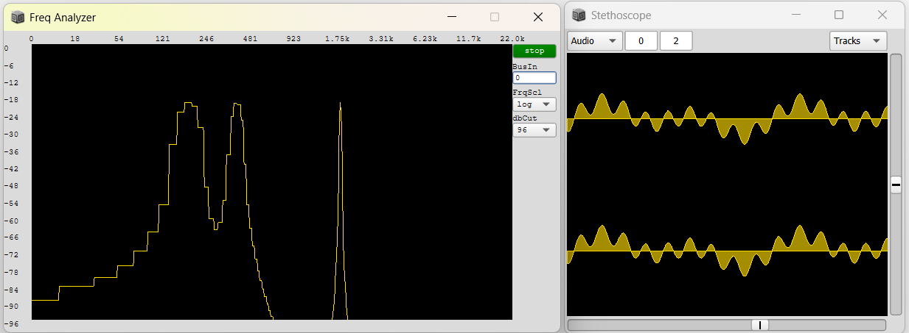
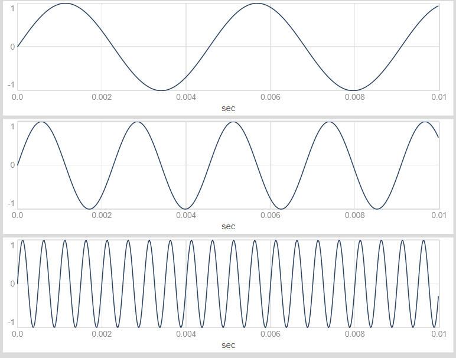
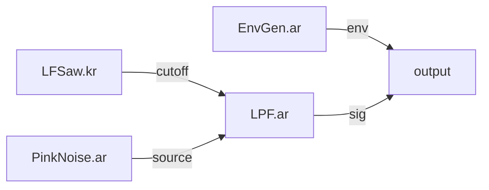

---
tags:
    - Artikler
---

??? abstract "Introduktion til kapitlet"

    Dannelse og transformation af lyd er en central del af musik- og lydprogrammering. Redskaber som SuperCollider tillader os at arbejde meget fleksibelt med lyd på et detaljeret niveau. Dette kan give os unikke lyddesign til brug i musikalsk komposition, interaktive systemer, musikinstrumenter, lydkunst mm. Samtidig giver arbejdet med lyddesign på dette niveau en glimrende forståelse af principperne bag digital musik- og lydteknologi. I dette og de efterfølgende kapitler tager vi hul på dannelse og transformation af lyd ved hjælp af oscillatorer, filtre, envelopes, sample-afspillere mm. Disse signalbehandlingsredskaber kaldes UGens, og vi kigger i dette kapitel nærmere på, hvordan UGens fungerer, og hvordan vi anvender og sammensætter dem i såkaldte UGen-funktioner.

# UGens og signalflow

Det grundlæggende redskab for musikalsk lyddesign i SuperCollider og lignende platforme som puredata, Max/MSP, Csound m.fl. er såkaldte [UGens](https://en.wikipedia.org/wiki/Unit_generator), Unit Generators. Eksempler på UGens er oscillatorer, filtre, lyttemaskiner, envelope-generatorer og mange enheder til at generere og transformere lydsignaler. De kan sammenlignes med komponenterne i et elektronisk kredsløb eller modulerne i en modulær synthesizer. I kildekode kan vi kombinere UGens på mange forskellige måder med et fleksibelt signalflow og på den måde skabe unikke lyddesign.

Når du arbejder med UGen-funktioner og eksperimenterer med klangdannelse, kan du med fordel starte et oscilloskop og et indbygget redskab til spektralanalyse, så du kan se en grafisk repræsentation af serverens lydlige output. Flyt evt. vinduerne på din skærm, så du kan se både bølgeform og frekvensspektrum på én gang.

```sc title="Start lydserver og visuelle redskaber"
s.boot;
(
// Når serveren er bootet
s.scope;
s.freqscope;
)
```

I spektralanalyse-vinduet viser den vandrette akse frekvenser, målt i hertz, mens den lodrette akser viser lydstyrke ved den givne frekvens, målt i decibel. På oscilloskopet viser den vandrette akse tid, mens den lodrette akse viser lydsignalets udsving.

{ width="70%" }

## Oscillator-UGens

Lad os skabe vores første UGen-funktion. Den noteres [ligesom andre funktioner](../01/a-funktioner.md) med tuborg-parenteser.

Den mest enkle UGen vi kan vælge til vores UGen-funktion er nok `SinOsc`, en sinustone-generator. Ønsker vi savtakkede eller firkantede bølgeformer, kan vi i stedet bruge `Saw` eller `Pulse`. Der er også mulighed for at afspille forskellige former for støj med fx `WhiteNoise` eller `PinkNoise`, samples med `PlayBuf` og `BufRd` eller live-lyd fra en mikrofon med UGen'en `SoundIn`. Du kan se en oversigt over de vigtigste UGens i [det dertilhørende cheat sheet](c-ugens.md), og brug af samples i SuperCollider dykker vi ned i [senere i bogen](../08/a-samples.md).

For at oprette en simpel oscillator bruger vi den relevante UGen's klassenavn sammen med method'en `.ar`. Den omsluttende UGen-funktion startes med method'en `.play`:

```sc title="Tre forskellige oscillatorer"
{SinOsc.ar}.play;
{Saw.ar}.play;
{Pulse.ar}.play;
```

### Oscillatorfrekvens og amplitude

For at styre oscillatorernes frekvens, kan vi angive den ønskede frekvens som det første argument til method'en `.ar`. Ønsker vi at justere oscillatorens amplitude, kan vi gange med den faktor, vi ønsker at skalere op eller ned.

```sc title="Amplitude og frekvens"
// Vi angive oscillatorens frekvens som det første argument til .ar-method'en
{SinOsc.ar(220)}.play;

// Vi skruer ned for lydstyrken ved at gange med 0.1
{SinOsc.ar(220) * 0.1}.play;
```

Hvis vi ønsker at se et fastfrosset billede af signalet fra en UGen-funktion, kan vi bruge method'en `.plot` i stedet for `.play`. Her plotter vi eksempelvis tre forskellige sinusbølger[^1] på én gang:

```sc title="Plot af UGen-funktioner"
// Her frekvenser på 220Hz, 440Hz og 2000Hz
{SinOsc.ar([220, 440, 2000])}.plot;
```

{ width="70%" }

[^1]: Når vi noterer [en liste](../01/a-lister.md) som argument til en UGen, udfører SuperCollider typisk en såkaldt "multichannel expansion" til at oprette en særskilt UGen for hvert af listens elementer. Dette kigger vi nærmere på [senere](../07/a-oscillatorbanke.md).

## Modulation

Sinustonen ovenfor bliver hurtigt lidt monoton, så lad os skabe lidt bevægelse i lyden ved at modulere nogle af de lydlige parametre. Der findes grundlæggende to parametre, man kan manipulere ved en oscillator: *Tonehøjde* (der bestemmes af oscillatorens frekvens) og *lydstyrke* (der bestemmes af oscillatorens amplitude). Der findes også en tredje parameter, nemlig (initial)fase, men den udelader vi her for enkelhedens skyld.

### Ampltitude

Lad os først modulere sinustonens amplitude (lydstyrke). Det gør vi ganske enkelt ved *at gange med en anden UGen*. I dette eksempel bruger vi UGen'en `LFPulse`, som blot bevæger sig mellem 0 og 1 og dermed regelmæssigt tænder og slukker for lyden.

```sc title="Amplitudemodulation"
{SinOsc.ar(440) * LFPulse.kr(2) * 0.1}.play;
```


Dette ligger til grund for de klangdannelsesteknikker, som kaldes amplitude modulation (AM) og ring modulation (RM).

### Frekvens

Vi kan også modulere frekvensen. Her erstatter vi den fast angivne frekvens på 440hz med en anden SinOsc. Det er her nødvendigt at skalere outputtet fra den anden SinOsc, så vi får hørbare frekvenser (over 20hz) - det gør vi med .range, her fra 200hz til 400hz.

```sc title="Frekvensmodulation"
{SinOsc.ar( SinOsc.kr(5).range(200, 400) ) * 0.1}.play;
```


Dette ligger til grund for den klangdannelsesteknik som kaldes frequency modulation (FM).

## Signalflow med lokale variabler

Koden begynder nu at blive for kompliceret til at stå på én linje. For at gøre signalflowet mellem de forskellige UGens mere overskueligt og fleksibelt, kan vi derfor dele koden op, så den står på flere forskellige linjer. Dette indebærer, at vi indfører lokale variabler, så vi kan henvise til de forskellige signaler i vores UGen-funktion.

```sc title="Mere logisk og læsbar kildekode med lokale variabler"
(
{ // Samme lyd som ovenfor, men kildekoden er lettere at læse og justere
    var modulator = SinOsc.kr(5).range(200, 400);
    var sig = SinOsc.ar(modulator);
    sig * 0.1;
}.play;
)
```

Vi kan oprette lige så mange lokale variabler, som vi har lyst til, de skal blot erklæres i begyndelsen af funktionen. Her er et eksempel med LFO-modulation, hvor en del forskellige UGens er på spil. Heldigvis kan vi gøre koden overskuelig, når vi bruger lokale variabler. Gæt selv, evt. med hjælp fra nedenstående graf, hvordan signalflowet fungerer i dette eksempel.

```sc title="Eksempel på signalflow med lokale variabler"
(
{
    var source = PinkNoise.ar;
    var env = EnvGen.ar(Env.triangle(5));
    var cutoff = LFSaw.kr(5).exprange(220, 880);
    var sig = LPF.ar(source, cutoff);
    sig = sig * env;
    sig * 0.1;
}.play;
)
```




/// caption
Signalflow mellem de anvendte UGens
///

## Hvad er .ar og .kr?

Vi har hidtil primært arbejdet med SuperColliders patterns. Patterns kører i SuperColliders *fortolker* - det program, som fortolker den kildekode, vi eksekverer. I modsætning hertil kører UGens på SuperColliders *lydserver*, [som er et andet program end fortolkeren](../01/a-brugerflade.md#brugerflade-fortolker-og-lydserver). Rammen for vores arbejde med UGens er UGen-funktioner, der rent syntaktisk noteres ligesom de [funktioner](../01/a-funktioner.md), vi tidligere har set. UGen-funktioner udskiller sig dog ved, at de beskriver noget, man med et teknisk udtryk kan kalde *signalgrafer*. Det betyder blot, at vores UGen-funktioner ikke bliver kaldt med `.value`, som vi tidligere har set med almindelige funktioner. Da de skal repræsentere lyd- og kontrolsignaler, udregnes de mange gange per sekund.

Hvor ofte "kører" vores UGen-funktion så? Jo, du har nok bemærket i eksemplerne ovenfor, at vi altid bruger en af to forskellige methods til at oprette UGens - `.ar` og `.kr`[^2]. Disse methods henviser til de to forskellige frekvenser hvormed forskellige signalers værdi kalkuleres i lydserveren. *Audio rate* (`.ar`) svarer til serverens samplerate. Denne kan ligesom i anden musiksoftware justeres, men typisk vil sampleraten være 44,1 kHz eller 48 kHz. Det betyder, at UGens, der oprettes med `.ar` får beregnet deres konkrete værdi 48.000 gange per sekund (ved en samplerate på 48 kHz). Med et teknisk udtryk siger man, at audio rate UGens er "sample accurate". *Control rate* (`.kr`) er ikke lige så præcist som audio rate, da den for at spare på computerens regnekraft beregnes med en lavere frekvens[^1], som dog er tilstrækkeligt præcis til eksempelvis at modulere en indstilling for en audio rate UGen.

[^2]: Der findes også en tredje "rate" i SuperCollider - `.ir`, som står for initialization rate. Den er kun relevant i nogle enkelte ydertilfælde og dækkes derfor ikke yderligere her.

Hvornår skal man så bruge disse to methods? Som tommelfingerregel kan vi følge nedenstående råd:

`.ar`

:   Vi bruger typisk `.ar` til at oprette UGens, som indeholder et direkte hørbart signal, såsom oscillatorer, samples og digitale filtre.

`.kr`

:   Vi bruger typisk `.kr` til at oprette UGens, som modulerer andre UGens, fx LFO'er, envelope-generatorer og triggere.

En af følgerne af, at UGens så at sige "lever" på lydserveren, er at man desværre ikke kan bruge patterns inde i UGen-funktioner. Men [senere i kurset](../05/a-synthdef.md) kommer vi til at kombinere patterns og UGens ved at registrere vores UGen-funktioner som såkaldte `SynthDef`s. Så kan vi spille på UGen-funktioner ved hjælp af patterns. Forholdet mellem patterns og UGens er nemlig lidt ligesom forholdet mellem en musiker (patterns) og et instrument (UGens); Man kan godt komponere med patterns uden at bruge UGens (fx ved at spille på et andet instrument via MIDI). Man kan også godt komponere udelukkende ved hjælp af UGens (ligesom en selvkørende, modulær synthesizer). Men den særlige fordel ved platforme som SuperCollider er kombinationen af de to niveauer: Når vi bruger det righoldige [pattern](../02/a-patterns-intro.md)-bibliotek sammen med vores egne UGen-lyddesign, får vi utroligt mange kompositionsmuligheder.
