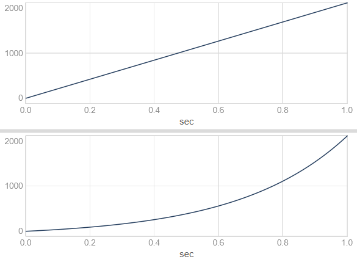
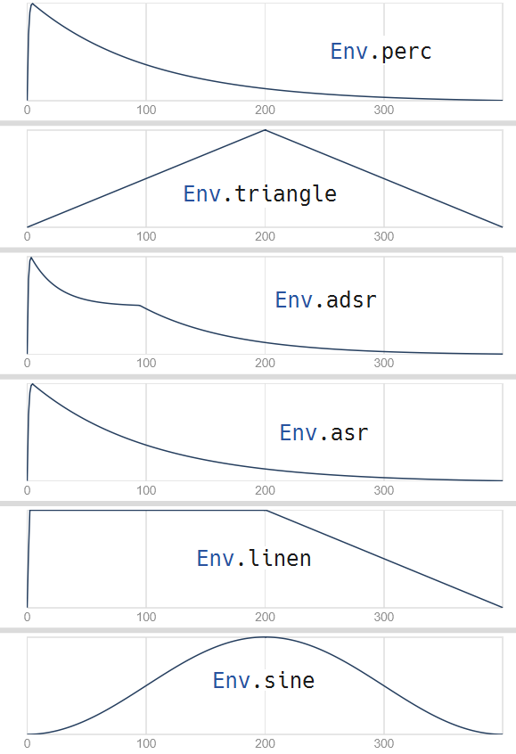
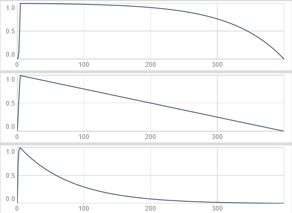

---
tags:
    - Artikler
---

??? abstract "Introduktion til kapitlet"

    Lydens forandring over tid er en vigtig del af lyddesign. Et af de vigtigste redskaber til at arbejde med lydlig forandring over tid er envelopes. Envelopes anvendes i elektronisk klangdannelse typisk til at styre en tone eller en lyds volumen over tid, men envelopes kan med fordel bruges på mange andre måder til at skabe forandring i lyden over tid. Dette kapitel introducerer til brug og design af envelopes i SuperCollider. Der introduceres også til SynthDefs, som er et centralt redskab til at lave UGen-funktioner til fleksible opskrifter på lyddesign, der kan anvendes sammen med patterns.

# Brug af envelopes

Hvor mange synthesizere kun har én envelope, typisk af typen ADSR (attack-decay-sustain-release), har SuperCollider en række forskellige, indbyggede envelopes. Man kan også definere sine egne envelopes. Det er endda muligt at loope envelopes, så de kommer til at udgøre LFO'er. Dermed kan envelopes potentielt være et særdeles kreativt virkemiddel.

## Simple linjer

De mest enkle envelope-generatorer er `Line` og `XLine` - UGens, som genererer en henholdsvis lineær og eksponentiel udvikling fra ét punkt til et andet over et specificeret tidsrum. Her er et eksempel, hvor envelopen bevæger sig fra 100 til 2000 i løbet af 1 sekund:

```sc title="Line og XLine"
Line.kr(100, 2000, 1)
XLine.kr(100, 2000, 1)
```

{ width="80%" }

Vi bruger `Line` og `XLine` ligesom andre UGens, fx til at styre frekvensen for en oscillator:

```sc title="Line og XLine over forskellige tidsintervaller"
{SinOsc.ar(Line.kr(100, 800, 1)) * 0.1}.play;      // lineær udvikling over 1 sekund
{SinOsc.ar(XLine.kr(100, 800, 5)) * 0.1}.play;     // eksponentiel udvikling over 5 sekunder
{SinOsc.ar(XLine.kr(100, 800, 0.050)) * 0.1}.play; // eksponentiel udvikling over 50 milisekunder
```


## Envelopes for enhver smag

`Line` og `XLine` genererer envelopes med ét segment (dvs. ét tidsinterval med ét start- og ét slutpunkt). Envelopes har imidlertid typisk mere end ét segment. Og de forskellige segmenter kan have meget forskellige former/"krumninger".

Vi bruger `Env`-klassen til at definere disse mere sammensatte envelopes. Her er fx nogle forskellige indbyggede envelopes:

```sc title="Indbyggede envelopes"
Env.perc
Env.triangle
Env.adsr
Env.asr
Env.linen
Env.sine
```

Vi kan vise en grafisk repræsentation med `.plot` - fx `Env.perc.plot`. Her er et plot af de ovennævnte envelopes:

{ width="80%" }

### Specifikation af segmentvarigheder og krumning

Lad os kigge nærmere på et eksempel - den simple envelope `Env.perc`.Den har to segmenter kaldet attack og release, og vi kan specificere deres varighed med argumenter. Her angiver vi en attack-tid på 1 sekund og en release-tid på 4 sekunder:

```sc title="Env.perc"
Env.perc(1, 4)

// Vi kan også vælge blot at justere fx release-segmentet:
Env.perc(releaseTime: 10)

// Segmenternes krumning kan justeres med argumentet curve:
[Env.perc(curve: 5), Env.perc(curve: 0), Env.perc(curve: -5)].plot;
```

{ width="80%" }

### Brug af envelope

Når vi skal bruge en envelope som `Env.perc` i vores lyddesign, skal vi tage højde for, at `Env` blot specificerer en envelope-form - en `Env` er ikke en UGen. For at bruge `Env`-baserede envelopes skal vi  anvende `EnvGen`, som er en envelope-generator-UGen. Vi fortæller `EnvGen`, at vi ønsker en `Env.perc` ved at angive den som første argument: `EnvGen.kr(Env.perc)`.

Vi kan nu bruge `EnvGen` ligesom `Line` og `XLine` ovenfor - fx til at modulere lydstyrken for en oscillator. Som nævnt i kursusgang 3 gør vi dette ved ganske enkelt at gange outputtet fra oscillatoren med outputtet fra envelope-generatoren:

```sc title="EnvGen og Env.perc"
{PinkNoise.ar * EnvGen.kr(Env.perc) * 0.1}.play;
```


Inden vi går videre, er det vigtigt at skrive sig bag øret, at `EnvGen` ofte noteres implicit (skjult). Følgende to linjer har præcis samme resultat, og man kan selv vælge hvilken form man foretrækker:

```sc title="Implicit EnvGen"
{PinkNoise.ar * EnvGen.kr(Env.perc) * 0.1}.play;
{PinkNoise.ar * Env.perc.kr * 0.1}.play;
```

Det er ofte nyttigt at skille disse elementer ad på forskellige linjer og bruge lokale variabler:

```sc title="Envelope som lokal variabel"
{
    var env = EnvGen.kr(Env.perc);
    var sig = PinkNoise.ar;
    sig * env * 0.1;
}.play;
```

Når vi gemmer envelope-generatoren under en lokal variabel, kan vi efterfølgende bruge envelope-signalet til flere forskellige formål. Fx kan vi styre både tonehøjde og lydstyrke med den samme envelope, således at flere parametre udvikler sig over tid i takt med hinanden. Dette kan give anledning til yderst interessante lyddesign, alt efter hvilke parametre man modulerer med envelopen!

Lad os tage et eksempel:

```sc title="Brug af envelope til modulation af flere parametre"
{
    // Envelopen oprettes og gemmes under den lokale variabel env
    var env = EnvGen.kr(Env.perc(0.1, 5));
    // Envelopesignalet skaleres med .exprange til en mere passende rækkevidde for tonehøjde
    // Resultatet gemmes under variablen freq, som bruges til oscillatoren Pulse
    var freq = env.exprange(440, 880);
    var sig = Pulse.ar(freq);
    // Det umodificerede envelopesignal anvendes til at styre lydstyrken
    sig * env * 0.1;
}.play;
```


## Standardenvelopes

Ud over `Env.perc` og `Env.new/Env.circle` har vi adgang til en række standard-envelopes. Her kan vi skelne mellem to slags envelopes: Selvafsluttende envelopes, hvor vi kender eller angiver varigheden på forhånd, og vedvarende envelopes, hvor varigheden afhænger af .

### Selvafsluttende envelopes (uden gate)

Selvafsluttende envelopes som `Env.perc` varer præcis den tid det tager at gennemløbe alle envelopens segmenter. Envelopens varighed er fast og afhænger ikke af en såkaldt gate. Det gælder blandt andet disse standardenvelopes:

- `Env.perc`
- `Env.triangle`
- `Env.linen`
- `Env.sine`

### Vedvarende envelopes (med gate)

Vedvarende (sustaining) envelopes bliver hængende på et bestemt punkt imellem to segmenter, indtil de bliver bedt om at gå videre. Dette kender vi fra keyboards, hvor tonen begynder at klinge, når vi trykker tangenten ned, og fortsætter indtil vi slipper tangenten igen. Måden hvorpå vi beder envelopen om at fortsætte til næste segment er ved at bruge en såkaldt gate. Centrale eksempler er de følgende envelopes:

- `Env.asr`
- `Env.adsr`
- `Env.cutoff`
- `Env.dadsr`

Når vi bruger `Pbind` og patterns til at styre artikulationen af toner, styres åbning og lukning af gates til envelopes automatisk. Vi kan dog sagtens anvende vedvarende envelopes med gates manuelt ved at indføre et gate-argument til vores UGen-funktion og angive det som argument nr. 2 til `EnvGen`. Derefter kan vi bruge method'en `.set` til at justere på indstillingen på et vilkårligt tidspunkt:

```sc title="Simpel ASR-envelope med gate"
// Start en tone med åben gate (gate = 1)
~tone = {arg gate = 1; SinOsc.ar * EnvGen.kr(Env.asr, gate);}.play;
// Vent lidt, før vi går videre til release-segmentet
~tone.set(\gate, 0);
```

## Automatisk oprydning med doneAction

Envelopes er forbundet med noget, der hedder `doneAction`, som angår hvad SuperColliders lydserver skal gøre med vores UGen-funktion, når envelope-generatoren har gennemløbet alle envelopens segmenter. I eksemplerne ovenfor har vi ikke bedt SuperCollider om at gøre noget særligt, når envelopen er slut. Men hvis vores UGen-funktion stopper med at producere lyd, når envelopegeneratoren har gennemløbet alle envelopens segmenter, bør vi faktisk fjerne klyngen af UGens i vores UGen-funktion (der betegnes en `Synth`) fra serveren igen.

Vi kan fjerne alle kørende `Synth`s fra lydserveren ved at taste Ctrl/Cmd-punktum. Men det er ikke praktisk at gøre manuelt, så hvordan indretter vi en UGen-funktion, så den kan fjerne sig selv automatisk, når en envelope er færdiggjort? Det gør vi ved hjælp af envelope-generatorens såkaldte `doneAction`-argument.

Vi kan få vist aktive `Synth`s på lydserveren ved at åbne et vindue, der viser serverens "Node Tree". Det kan vi gøre ved at køre `s.plotTree;` eller ved at klikke på de grønne tal nederst til højre i SuperColliders IDE og vælge "Show Node Tree". Sammenlign med et vågent øje på Node Tree-vinduet disse to eksempler og bemærk hvilken forskel `doneAction: Done.freeSelf` gør:

```sc title="Visning af Synths på lydserveren"
// Åben først Node Tree-vinduet
s.plotTree;

{PinkNoise.ar * EnvGen.kr(Env.perc) * 0.1}.play;
{PinkNoise.ar * EnvGen.kr(Env.perc, doneAction: Done.freeSelf) * 0.1}.play;
```

Hvornår skal man så bruge `doneAction: Done.freeSelf`? Jo, hvis man har gang i flere forskellige envelopes inden for den samme UGen-funktion (hvilket man sagtens kan have i SuperCollider), er det som tommelfingerregel en god idé *at bruge `doneAction: Done.freeSelf` til den envelope, som styrer tonens lydstyrke over tid*. Så undgår vi at få ophobet gamle `Synth`-nodes på lydserveren.

Hvis du er forvirret over forholdet mellem UGens, `Synth` osv., så er det helt i orden på nuværende tidspunkt. Det væsentlige her er blot at du forstår hvad `doneAction` betyder. Resten uddybes senere i dette kapitel i forbindelse med [interfacet mellem Synth, SynthDef og Pbind](a-synthdef.md#interfacet-mellem-synth-synthdef-og-pbind).

### Hvad er doneAction?

`doneAction: 2` og `doneAction: Done.freeSelf` betyder det samme - at Synth'en skal fjernes fra lydserveren, når envelopen er slut. Når vi noterer `EnvGen` er `doneAction` argument nr. 2, så man behøver ikke ekspicitere argumentets navn. Derfor giver alle fire kodelinjer herunder præcis samme resultat:

```sc title="Varianter over doneAction: 2"
{PinkNoise.ar * EnvGen.kr(Env.perc, doneAction: Done.freeSelf) * 0.1}.play;
{PinkNoise.ar * EnvGen.kr(Env.perc, Done.freeSelf) * 0.1}.play;
{PinkNoise.ar * EnvGen.kr(Env.perc, doneAction: 2) * 0.1}.play;
{PinkNoise.ar * EnvGen.kr(Env.perc, 2) * 0.1}.play;
```

Om man bruger `doneAction: 2` eller `doneAction: Done.freeSelf` er helt valgfrit. Førstnævnte er kortest at skrive, men sidstnævnte er umiddelbart lettest at forstå, når man man læser koden.
