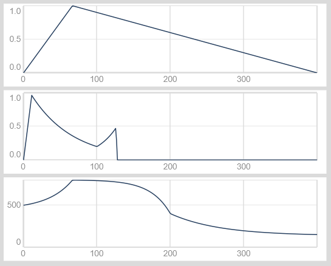
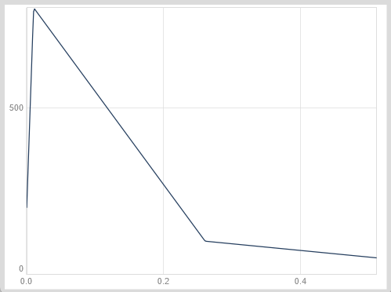

---
tags:
    - Artikler
---

# Specialdesignede envelopes og LFO'er

Ud over de indbyggede envelopes tilbyder SuperCollider rig mulighed for at opfinde nye envelopes. Hvis vi looper en envelope, kan vi endda defineres vores helt egne former til specialdesignede LFO'er!

## Design dine egne envelopes med Env.new

Vi definerer vores egne envelopes med `Env.new`. Argumenterne er som følger:

- En liste med start- og slutniveauer for de enkelte segmenter
- Dernæst angiver vi en liste med varigheder af de enkelte segmenter
- Valgfrit: Til sidst kan vi bestemme segmenternes krumning ved at angive en eller flere såkaldte curve-værdier

Her er et par eksempler:

```sc title="Hjemmestrikkede envelopes"
Env.new([0, 1, 0], [0.2, 1])
Env.new([0, 1, 0.2, 0.5, 0], [0.1, 1, 0.3, 3], \exp)
Env.new([500, 800, 400, 150], [1, 2, 3], [2, 5, -3])
```

{ width="80%" }

Lad os definere en ny envelope med tre segmenter, som vi vil bruge til at styre frekvensen for en oscillator:

- Først går vi fra 200 til 800, derefter til 100, og til sidst til 50.
- Første segment varer 10 milisekunder, de sidste to segmenter varer 250 milisekunder hver.

{ width="80%" }

```sc title="En envelope til at modulere oscillatorfrekvens"
( // Definér envelopen og gem den under en variabel
~frekvensEnvelope = Env.new(
    [200, 800, 100, 50], // niveauer
    [0.010, 0.250, 0.250]   // segment-varigheder
);
// Vis en grafisk repræsentation af envelopen
~frekvensEnvelope.plot;
)

( // Brug envelopen til at styre frekvens for en oscillator
{
    var env = EnvGen.kr(~frekvensEnvelope);
    SinOsc.ar(env) * 0.1;
}.play;
)
```


Lydeksemplet her fungerer bedst med højttalere eller hovedtelefoner, som kan gengive dybe frekvenser med en vis styrke (dvs. ikke laptophøjttalere eller ear buds).

## Envelope som LFO

En af de spændende muligheder med envelopes er, at de kan anvendes som LFO'er! Med `Env.circle`, har vi mulighed for at loope envelopes, så de fungerer som en slags oscillatorer.

`Env.circle` har næsten præcis samme syntaks som `Env.new`, vi skal blot tilføje en enkelt varighed til listen med segmentvarigheder - nemlig den tid det tager at vende tilbage til begyndelsen af envelopen, når vi looper.

```sc title="Envelope som LFO"
(
{ // Eksemplet fra ovenfor, tilpasset Env.circle med et ekstra tidsinterval (0.24)
    var env = EnvGen.kr(
        Env.circle(
            [200, 800, 100, 50],
            [0.01, 0.25, 0.25, 0.24]
        )
    );
    SinOsc.ar(env) * 0.1;
}.play;
)
```


Vi kan endda modulere segment-varighederne med en LFO eller en anden envelope ved hjælp af timeScale-argumentet i `EnvGen`. Som eksempel kan vi bruge en simpel `Line` til at skalere varighederne over 10 sekunder fra en faktor 6 til en faktor 0.2:

```sc title="Modulation af segmentvarigheder"
(
{
    var env = EnvGen.kr(
        Env.circle(
            [200, 800, 100, 50],
            [0.01, 0.25, 0.25, 0.24]
        ),
        timeScale: Line.kr(6, 0.2, 10));
    SinOsc.ar(env) * 0.1;
}.play;
)
```


