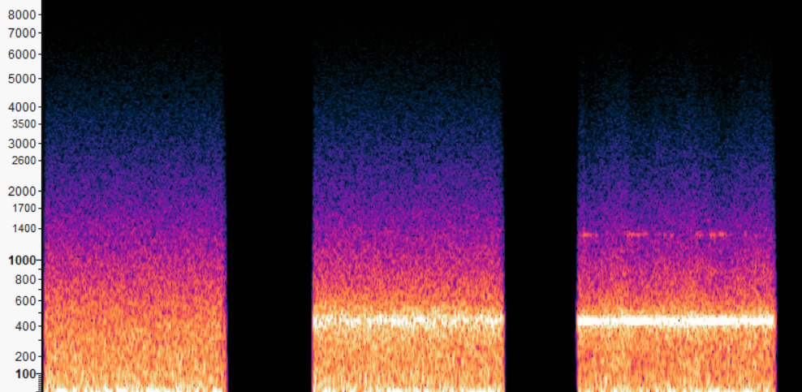

---
tags:
    - Artikler
---

??? abstract "Introduktion til kapitlet"

    Filteret er et allestedsnærværende redskab i elektronisk musikproduktion, lige fra de filtre, der udgør en equaliser, til de berømte filterkredsløb, som indgik i de tidlige Moog-synthesizere. Der findes en hel gruppe af klangdannelsesteknikker, som baseres på filtre, kaldet *subtraktiv klangdannelse*. I dette kapitel ser vi nærmere på brugen af filtre i SuperCollider, og vi arbejder med en række eksempler på subtraktiv klangdannelse fra simple blæser- og strygerlyde til lilletromme og streng-simulering med den såkaldte Karplus-Strong-algoritme.

# Filterbaseret klangdannelse

SuperCollider har en række indbyggede filter-UGens, der implementerer forskellige typer af digital lydfiltrering. Du kan se en oversigt over disse i [cheat sheat'et i slutningen af dette kapitel](c-filtre.md). De anvendes selvsagt med en anden lydkilde som input, der angives som første argument. Her er eksempelvis et par filtre, der dæmper forskellige dele af frekvensspektret for pink støj:

```sc title="Lav-  og højpasfiltre"
{LPF.ar(PinkNoise.ar) * 0.1}.play;
{HPF.ar(PinkNoise.ar) * 0.1}.play;
```

## Cutoff-frekvens

Ved de fleste filter-UGens kan vi angive cutoff-frekvensen som argument nr. 2. For god ordens skyld bør det nævnes, at cutoff-frekvenser bør holdes mellem 20Hz og 20kHz:

```sc title="Specifikation af cutoff-frekvens"
// Cutoff ved 500Hz
{LPF.ar(PinkNoise.ar, 500) * 0.1}.play;

// Cutoff ved 2000Hz
{LPF.ar(PinkNoise.ar, 2000) * 0.1}.play;
```


Cutoff-frekvensen kan [moduleres](../04/a-ugens.md#modulation) af andre UGens, fx en LFO. Her [skalerer](../04/a-skalering.md) vi outputtet fra LFO'en `LFTri` med `.exprange`:

```sc title="Modulation af cutoff-frekvens"
(
{
    var lfo = LFTri.kr(2).exprange(200, 2000);
    var source = PinkNoise.ar;
    LPF.ar(source, lfo);
}.play;
)
```


## Filterets resonans og argumentet 'rq'

Ved filtre som `RLPF` og `RHPF` kan man angive et argument for at styre filterets såkaldte "kvalitet". Kvalitet er i denne sammenhæng et lidt mærkeligt begreb, da denne indstilling ikke har noget direkte at gøre med en æstetisk kvalitet. I praksis påvirker kvalitetsindstilling både hvor hårdt der dæmpes i det behandlede signal og hvor meget resonans, der opstår ved cutoff-frekvensen. I SuperCollider angives filterkvalitet typisk i en reciprok form, altså "1/q". Det lyder kompliceret men betyder blot, at når vi er på 1, er resonansen skruet helt ned, hvorimod den er skruet højt op, når vi nærmer os 0. Indstil aldrig `rq` til 0 (hvilket ville svare til en uendelig mængde resonans).

```sc title="Variationer i rq"
{RLPF.ar(PinkNoise.ar, rq: 1) * 0.1}.play;
{RLPF.ar(PinkNoise.ar, rq: 0.1) * 0.1}.play;
{RLPF.ar(PinkNoise.ar, rq: 0.01) * 0.1}.play;
```


På et spektrogram kan vi se, hvordan de tre forskellige `rq`-værdier påvirker den bredspektrede støj fra `PinkNoise`. Bemærk, hvordan intensiteten skabt af resonans ved cutoff-frekvensen (440Hz) adskiller sig på de tre klip.

{ width="90%" }

## Filtrering af lydkilde med tonehøjde

Ovenfor arbejder vi for enkelhedens skyld med filtreret støj, men i musikalsk sammenhæng bruger vi naturligvis også filtre til at forme klangen af andre lydkilder. Det typiske eksempel er en savtakket eller firkantet bølgeform, som har et righoldigt overtonespektrum, der således med fordel kan formes for at opnå en ønsket klang. Her kan vi eksempelvis dæmpe overtonerne for en savtakket bølgeform:

```sc title="Filtrering af Saw"
{LPF.ar(Saw.ar(440), 1000) * 0.1}.play;
```

Dette er dog ikke særligt fleksibelt, da vi ikke blot kan spille en anden tone (dvs. bruge en anden oscillatorfrekvens) og forvente, at klangen (altså tonens overtonespektrum) er det samme som før, blot tilsvarende højere eller lavere i frekvens. Ønsker vi, at cutoff-frekvens tilpasser sig oscillatorens frekvens automatisk, kan det heldigvis let gøres ved at regne cutoff-frekvensen ud særskilt. Uanset hvad vi angiver under `freq` herunder, vil filterets cutoff-frekvens ligger en oktav højere end oscillatorens tonehøjde.

```sc title="Automatisk tilpasset cutoff-frekvens"
(
{
    var freq = 440;
    var cutoff = freq * 2;
    LPF.ar(Saw.ar(freq), cutoff) * 0.1;
}.play;
)
```

Ønsker vi at kunne styre afstanden mellem cutoff-frekvens og oscillatorfrekvens med et argument (fx hvis vi ønsker at lave en SynthDef med subtraktiv klangdannelse), kan vi angive dette på forskellige måder - jeg foretrækker typisk at angive filterets cutoff målt i antal oktaver over oscillatorfrekvensen, hvilket kan udregnes let med en faktor `freq * 2.pow(oktav)` (hvor `2.pow(5)` betyder "to i femte"). Det betyder ganske enkelt, at hvis oscillatorens frekvens er 100Hz, og vi ønsker en cutoff-frekvens 3 oktaver derover, ser regnestykket således ud: `100Hz * 2.pow(3) = 100Hz * 8 = 800Hz`.

```sc title="Automatisk tilpasset cutoff-frekvens"
(
SynthDef(\autoCutoff, {
    arg freq = 440, pan = 0,
    amp = 0.1, out = 0, cutoffOktav = 2;
    var sig = Saw.ar(freq);
    var env = EnvGen.kr(Env.perc(0.005, 3), doneAction: 2);
    var cutoff = freq * 2.pow(cutoffOktav);
    sig = LPF.ar(sig, cutoff);
    sig = sig * env;
    Out.ar(out, Pan2.ar(sig, pan, amp));
}).add;
)
```

Bemærk, at overtonespektret for de følgende toner er ens, blot flyttet relativt til tonehøjde:

```sc title="Demonstration af automatisk udregnet cutoff"
(
Pbind(
    \instrument, \autoCutoff,
    \octave, Pseq([3, 4, 5, 6]),
    \dur, 2,
).play;
)
```


Vi kan også fremstille variable klange ved at indstille cutoffOktav-argument med dets tilhørende nøgle i Pbind:

```sc title="Klanglig variation med filter-cutoff"
(
Pbind(
    \instrument, \autoCutoff,
    \cutoffOktav, Pseq([1, 2, 3, 4, 5]),
    \dur, 2,
).play;
)
```


Her kan man bemærke, at den perciperede intensitet fremstår kraftigere, når cutoff-frekvensen øges, da øret rammes af et bredere spektrum af overtoner. Dette blot for at minde om de psykoakustiske forhold som spiller ind på opfattelsen af intensitet - amplitude er ikke nødvendigvis den afgørende faktor.

## Cutoff moduleret af envelope

En meget udbredt klangdannelsesteknik angår en sammenkobling af envelope og cutoff-frekvens, således at cutoff-frekvensen moduleres af envelopen. Her kan vi på samme måde som ovenfor udregne en cutoff-frekvens baseret på envelope. Nedenstående SynthDef overdriver effekten med en `Env.triangle`, således at resultatet er tydeligt hørbart både i envelopens attack- og releasesegment.

```sc title="Cutoff-frekvens knyttet til envelope"
(
SynthDef(\envCutoff, {
    arg freq = 440, pan = 0,
    amp = 0.1, out = 0, duration = 5;
    var sig = Saw.ar(freq);
    var env = EnvGen.kr(Env.triangle(duration), doneAction: 2);
    var cutoff = freq * env.range(2, 8);
    sig = RLPF.ar(sig, cutoff, 0.1);
    sig = sig * env;
    Out.ar(out, Pan2.ar(sig, pan, amp));
}).add;
)
Synth(\envCutoff);
```


Dette afspejler hvad der også kendetegner lyden af akustiske instrumenter, nemlig at klangen forandrer sig over en tones levetid.
