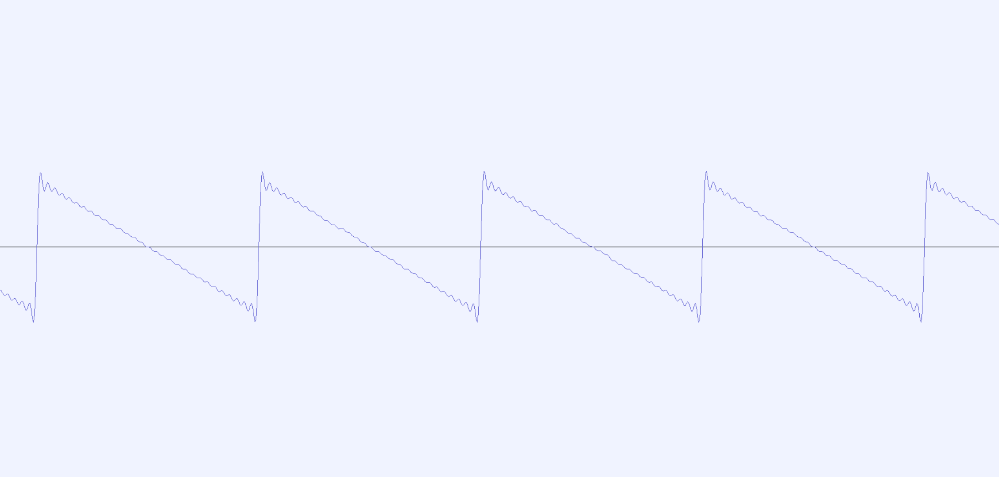
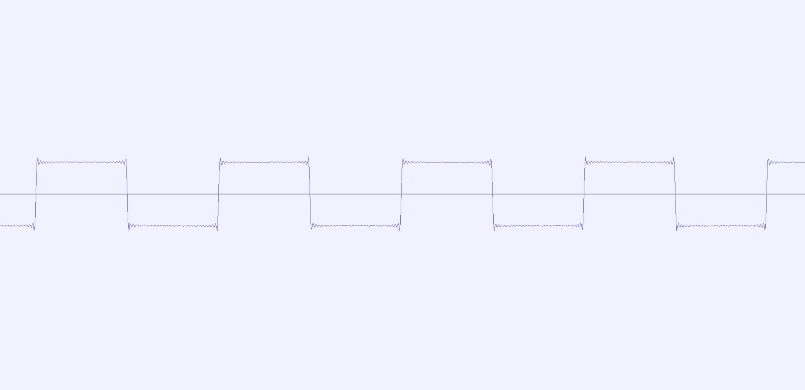
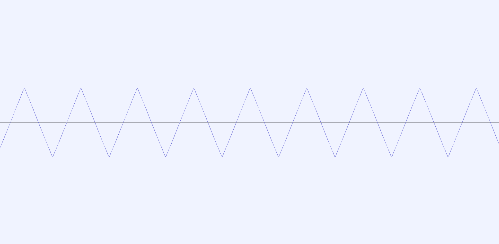

---
tags:
    - Artikler
---

# Additiv syntese

Klassisk additiv syntese baseres på ideen om, at komplekse bølgeformer og dermed interessante klange kan fremstilles (approximeres) ved ganske enkelt at sammenlægge en række sinusbølger, som svinger ved forskellige frekvenser og amplituder. Den matematiske idé bag dette findes i teorien om [Fourierrækker](https://lex.dk/Fourieranalyse).

## Standardbølgeformer

Som eksempel på additiv syntese kan vi starte med at generere tre standardbølgeformer. Kilden til algoritmerne er Thor Magnussons [-@magnusson2021] udmærkede introduktion til additiv syntese. Sørg for at [visualisere lydserverens output](../04/a-ugens.md#ugens-og-signalflow).

Disse bølgeformer udnytter den såkaldt naturlige [overtonerække](https://www.musikipedia.dk/overtoner), som består af en række overtoner med frekvenser, der ligger et helt antal gange over en grundtones frekvens. Hvis grundtonen svinger ved 100Hz, vil den første tone i den naturlige overtonerække svinge ved 200Hz, den næste ved 300Hz, derefter 400Hz og så fremdeles.

### Savtakket bølgeform

Den savtakkede bølgeform indeholder alle overtoner i overtonerækken. Her blot de første 30 overtoner.

```sc title="Fremstilling af en savtakket bølgeform ved addition af sinusbølger"
(
{
    var sig = 30.collect({
        arg num;
        var overtone = num + 1;
        SinOsc.ar(220 * overtone) * 0.5 / overtone;
    });
    sig.sum * 0.05;
}.play;
)
```


{ width="80%" }

### Firkantet bølgeform

Den firkantede bølgeform kan skabes med overtonerne med ulige numre, dvs. nr. 1 (grundtonen), nr. 3, nr. 5, nr. 7 osv. Overtonerne falder i amplitude, jo højere vi kommer op. Her blot de første 30 overtoner.

```sc title="Fremstilling af en firkantet bølgeform ved addition af sinusbølger"
(
{
    var sig = 30.collect({
        arg num;
        var overtone = num * 2 + 1;
        SinOsc.ar(220 * overtone) * 0.5 / overtone;
    });
    sig.sum * 0.05;
}.play;
)
```


{ width="80%" }

### Trekantet bølgeform

Den trekantede bølgeform kan ligesom den firkantede skabes med overtonerne med ulige numre, dvs. nr. 1 grundtonen, nr. 3, nr. 5, nr. 7 osv. Overtonerne falder i amplitude, jo højere vi kommer op, men med en lidt anden formel end ved den firkantede. Her blot de første 30 overtoner.

```sc title="Fremstilling af en trekantet bølgeform ved addition af sinusbølger"
(
{
    var sig = 30.collect({
        arg num;
        var overtone = num * 2 + 1;
        SinOsc.ar(440 * overtone, pi/2) * 0.7 / overtone.pow(2);
    });
    sig.sum * 0.1;
}.play;
)
```


{ width="80%" }

## Andre eksempler

Man behøver naturligvis ikke begrænse sig til standardbølgeformer eller for den sags skyld den naturlige overtonerække.

### Ikke-standard bølgeform

En ikke-standard bølgeform, som består af hver tredje overtone:

```sc title="Fremstilling af en bølgeform med hver 3. overtone ved addition af sinusbølger"
(
{
    var sig = 15.collect({
        arg num;
        var overtone = num * 3 + 1;
        SinOsc.ar(220 * overtone) * 0.6 / overtone
    });
    sig * 0.1;
}.play;
)
```


### En klokkelyd

Dette eksempel på en klokkelyd er løseligt baseret på et eksempel fra Curtis Roads[-@roads2023, p. 123]. Lyden indeholder følgende sinustoner:

- En *grundtone*, som klinger ved 200Hz
- En *overtone*, som klinger ved 2000Hz
- To *partialtoner* (dvs. ikke-harmoniske overtoner), som klinger ved henholdsvis 347,5Hz og 9921,8Hz

```sc title="Klokkelyd beskrevet af Curtis Roads"
(
{
    var freqs = [200, 347.5, 2000, 9921.8];
    var amplitudes = [0.73, 0.18, 0.05, 0.04];
    var sig = SinOsc.ar(freqs) * amplitudes;
    var env = EnvGen.kr(Env.perc, doneAction: Done.freeSelf);
    sig = sig.sum;
    sig.dup * env * 0.1;
}.play;
)
```


### En mere kaotisk klokkelyd

Klokkelyde er generelt kendetegnet ved et højt indhold af partialtoner. For at skabe unikke lyde kan vi give hver partialtone en tilfældig frekvens, amplitude og envelope. Dertil udnytter vi de to generatorer `Rand` og `ExpRand`, som genererer en tilfældig værdi mellem et minimum og et maksimum, når Synth'en startes. Da vi ikke har én envelope, som styrer lydstyrken, kan vi heller ikke vide hvilken af de 16 envelopes, der skal afslutte Synth'en med `doneAction`. Derfor anvender vi en særlig UGen kalder `DetectSilence`, som kan stoppe Synth'en, når den har detekteret stilhed i et givet tidsrum.

Kør blokken flere gange for at høre variationsmulighederne. Bemærk hvor længe de forskellige partialtoner klinger på grund af forskellige længder af release-segmenter.

```sc title="Kaotisk klokkelyd"
(
{
    var sig = 16.collect({
        var freq = ExpRand(200, 8000);
        var amp = ExpRand(0.05, 0.8);
        var release = Rand(2, 6);
        var env = EnvGen.kr(Env.perc(0.01, release));
        SinOsc.ar(freq) * amp * env;
    });
    sig = sig.sum;
    DetectSilence.ar(sig, doneAction: Done.freeSelf);
    sig.dup * 0.1;
}.play;
)
```


Se i øvrigt også afsnittet om [Rissets klokke](a-risset.md).
