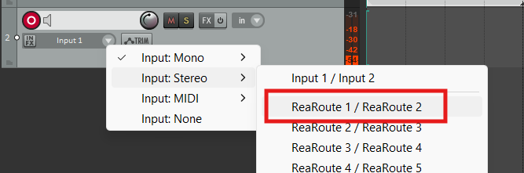

# Optag lyd fra SuperCollider

På et tidspunkt i din rejse med musik- og lydprogrammering ved hjælp af SuperCollider bliver det relevant at kunne bruge lyd fra SuperCollider i andre programmer. Det kan fx være vi vil eksportere en atmosfærisk lydtekstur skabt med granular syntese eller en melodi, vi har genereret ved hjælp af subtraktiv syntese og patterns. Hertil findes der i SuperCollider flere metoder, som passer til forskellige scenarier. Den interne optagelse er mest enkel og anbefales til begyndere, men at route signalet fra SuperCollider til en DAW er en fleksibel og nyttig metode.

## Intern optagelse af SuperColliders lydserver

Det er ganske enkelt at optage outputtet fra lydserveren og gemme optagelsen i en lydfil:

```sc title="Enkel optagelse med s.record"
// Start optagelsen
s.record;

// Spil noget lyd
{ Pulse.ar([220, 222]) * Env.perc.kr(2) }.play;

// Afslut optagelsen
s.stopRecording;

// Tilgå mappen hvor lydoptagelsen er gemt
Platform.recordingsDir.openOS;
```

Efter ovenstående linjer er kørt, vil SuperColliders post window vise hvor på din harddisk, lydfilen med optagelsen er gemt. Som udgangspunkt gemmes optagelser i en mappe, der kan findes ved at køre en linje med koden `Platform.recordingsDir;`. Filerne som indeholder optagelserne får tildelt et navn med et unikt timestamp, så flere optagelser foretaget efter hinanden ikke overskriver eksisterende filer.

I stedet for den automatiske navngivning er det muligt at angive filsti og -navn. Man kan også definere antal kanaler der skal optages samt en varighed for optagelsen mm.[^1]. Her eksempelvis en fil, der hedder "optagelse.wav" og gemmes under mappen "C:/samples", har to lydkanaler (dvs. stereo) og varer tre sekunder:

[^1]: Du kan læse nærmere om argumenterne til `s.record()` i [SuperColliders dokumentation](https://docs.supercollider.online/Classes/Server.html#-record).

```sc title="Argumenter til s.record"
s.record(
    path: "C:/samples/optagelse.wav",
    numChannels: 2,
    duration: 3
);
// s.stopRecording er ikke nødvendigt her
```

Laver du optagelser på denne måde, bør du være opmærksom på, at kører man koden ovenfor flere gange, vil den seneste eksekvering overskrive den tidligere optagelse. Man mister dermed de første "takes".

## Optagelse med præcist begyndelsestidspunkt

Fordi der skal allokeres buffer-hukommelse til optagelsen starter `s.record` optagelsen et kort stykke tid efter, at kodelinjen er kørt. Det er lidt upraktisk, hvis man gerne vil starte optagelsen, præcist når man sætter en lyd i gang. Derfor kan man forberede optagelsen med `s.prepareForRecord`, så den kan startes på et præcist tidspunkt:

```sc title="Forberedt optagelse"
// Her kan path og numChannels evt. specificeres som argumenter
s.prepareForRecord();

(
// Optagelsen startes og stopper automatisk igen efter 1.1 sekund
s.record(duration: 1.1);
// Vi starter også en stereo-lyd, som varer lidt mere end 1 sekund
{ Pulse.ar([220, 222]) * Env.perc.kr(2) }.play;
)
```

## Superhurtig NRT-optagelse

Hvis man har lavet en algoritme, der kan fremstille lydoptagelser der er lange eller et stort antal, kan det være nyttigt at få SuperCollider til at generere lydfilerne i "non-realtime" - deraf tilnavnet NRT. Det er et lidt mere kompliceret emne, som læseren selv kan studere nærmere i [SuperColliders dokmentation](https://docs.supercollider.online/Guides/Non-Realtime-Synthesis.html) samt i [en udmærket blog-post af Mads Kjeldgaard](https://madskjeldgaard.dk/posts/2019-08-05-supercollider-how-to-render-patterns-as-sound-files-using-nrt/).

## Routing fra SuperCollider til DAW

I mange tilfælde er det nyttigt at route lyden fra SuperCollider over til et andet program, fx en DAW. Det kan man gøre på tre overordnede måder, som nævnt i [Abletons udmærkede vejledning](https://help.ableton.com/hc/en-us/articles/360010526359-How-to-route-audio-between-applications):

- Analog loopback
- Digital loopback
- Virtuel audio routing

Analog og digital *loopback* beror på, at der sendes lyd ud af et lydkorts udgange og direkte tilbage via lydkortets indgange. Nogle lydkort-drivere understøtter, at dette kan gøres uden fysiske kabler. Disse tilgange kræver typisk et eksternt lydkort.

Virtuel audio routing kan udføres uden særlig hardware (eksternt lydkort) og er derfor en meget anvendt tilgang. Det udføres som regel med tredjepartssoftware, der figurerer i styresystemet som en ekstra lydkortdriver. Denne kan så både bruges som in- og output i programmer som SuperCollider og DAWs. I [vejledningen fra Ableton](https://help.ableton.com/hc/en-us/articles/360010526359-How-to-route-audio-between-applications) fremgår en række redskaber til Mac og Windows. På Linux findes der udmærkede redskaber som [jack](https://jackaudio.org/) og [pipewire](https://www.pipewire.org/) til avanceret, intern audio-routing.

### Eksempel - Windows: SuperCollider til Reaper via ReaRoute

Som eksempel på virtuel audio routing kan vi tage det scenarie, at en Windows-bruger vil sende lyd fra SuperColliders lydserver til DAW'en Reaper. Dette kan gøres ved hjælp af systemet [ReaRoute](https://www.youtube.com/watch?v=OnfTq8EtluU), der følger med Reaper, hvis man vinger det af under installationen. Fremgangsmåden er som følger:

1. Start den virtuelle lyddriver
    1. Når vi har installeret ReaRoute, starter den automatisk, når vi starter Reaper.
1. Forberedelse i Reaper
    1. Start Reaper.
    1. Aktivér derefter et spor til optagelse og vælg ReaRoute som audio-input.
    { width="80%" }
    1. Du er nu klar til at se og høre outputtet fra SuperCollider i Reaper.
1. Indstil SuperCollider
    1. I SuperCollider kan vi indstille lydserveren til at sende lyden til et bestemt output ved hjælp af `s.options.device = "Mit lydkort";`. Men hvordan ved man, hvad man skal skrive i stedet for "Mit lydkort"?
        1. Når man booter lydserveren med `s.boot`, vises en liste med mulighederne under `Device options:`.
        1. Her vil der fremgå en linje, der minder om denne: `- ASIO : ReaRoute ASIO (x64)   (device #9 with 16 ins 16 outs)`.
        1. ReaRoutes navn i SuperCollider er altså `"ASIO : ReaRoute ASIO (x64)"`.
        1. Vi angiver derfor `s.options.device = "ASIO : ReaRoute ASIO (x64)";`.
    1. Valget af ReaRoute træder først i kraft, næste gang vi booter serveren. Derfor kører vi `s.reboot;` (eller `s.boot`, hvis serveren ikke er bootet allerede).
        1. Herefter kan vi se, hvilken port SuperCollider sender lyd til under `Booting with:` i post window.
    1. Test at lyden går igennem til Reaper: `{PinkNoise.ar * Env.perc.kr(2)}.play;`
